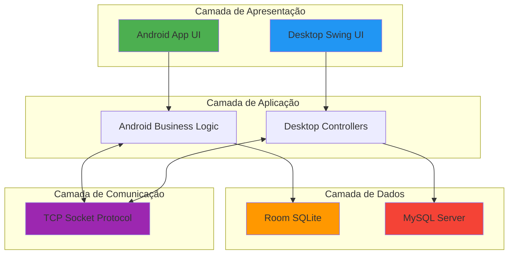
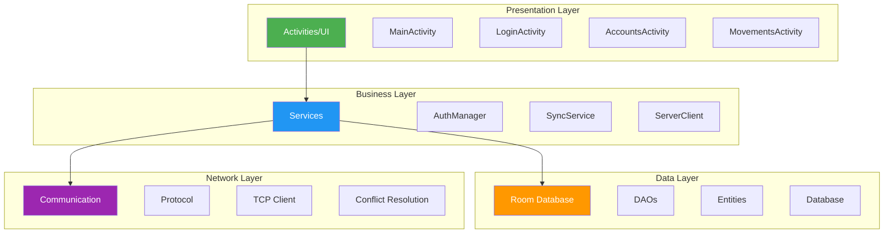
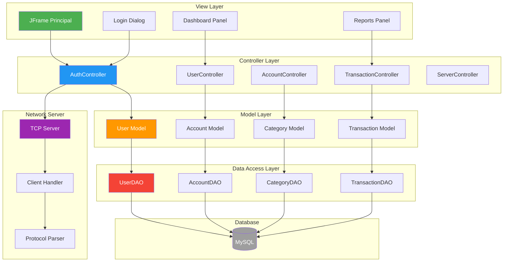
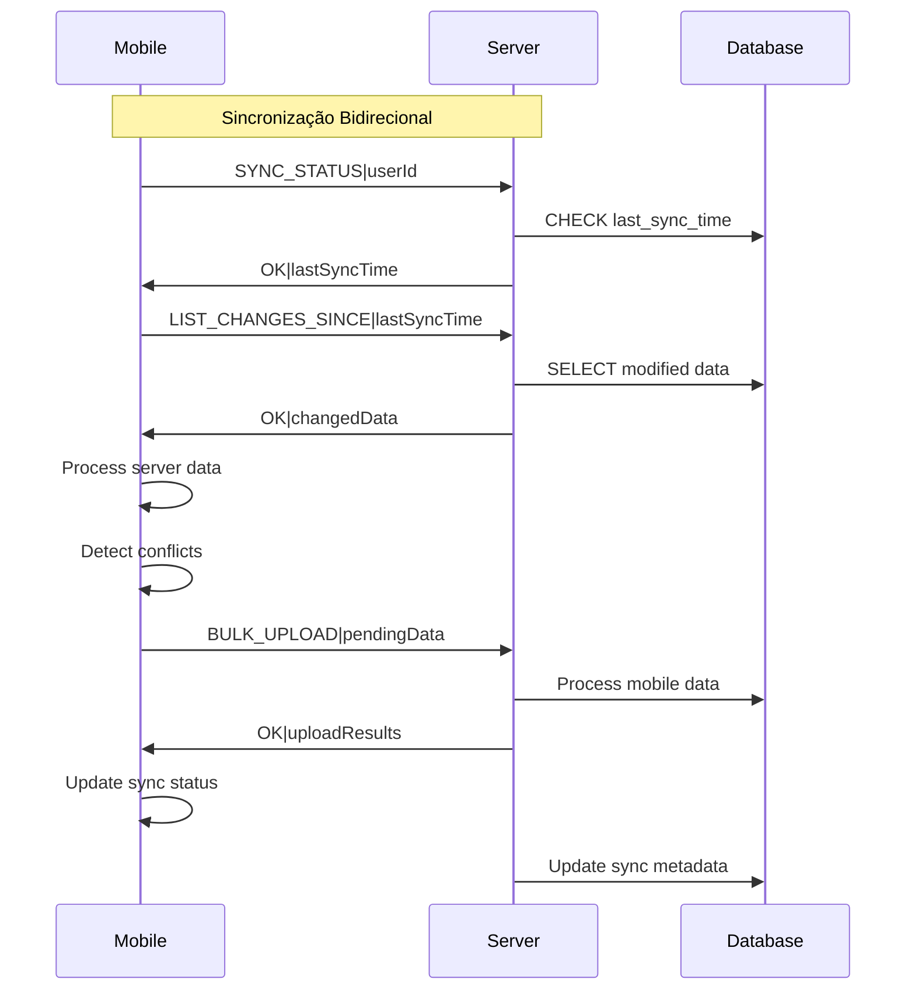
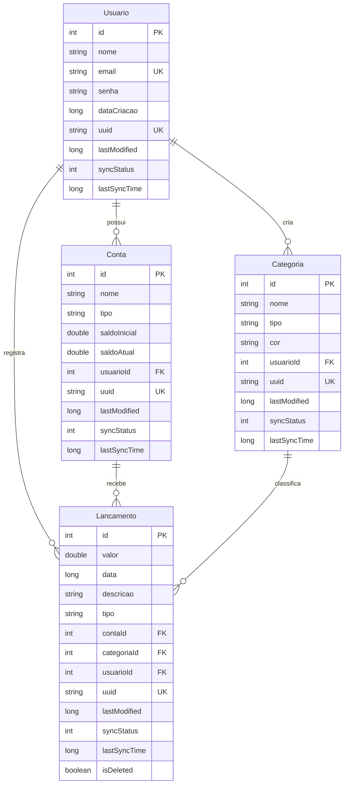
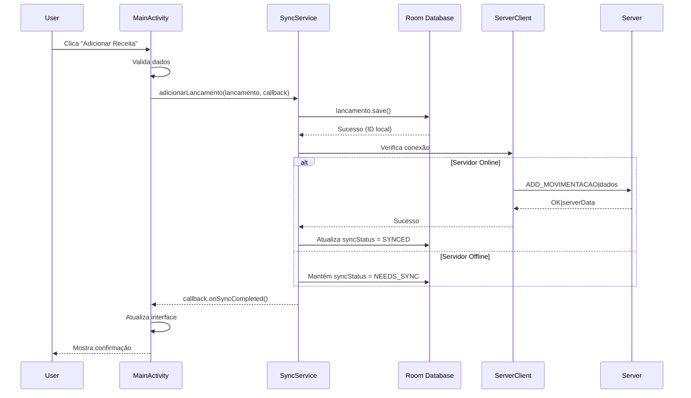
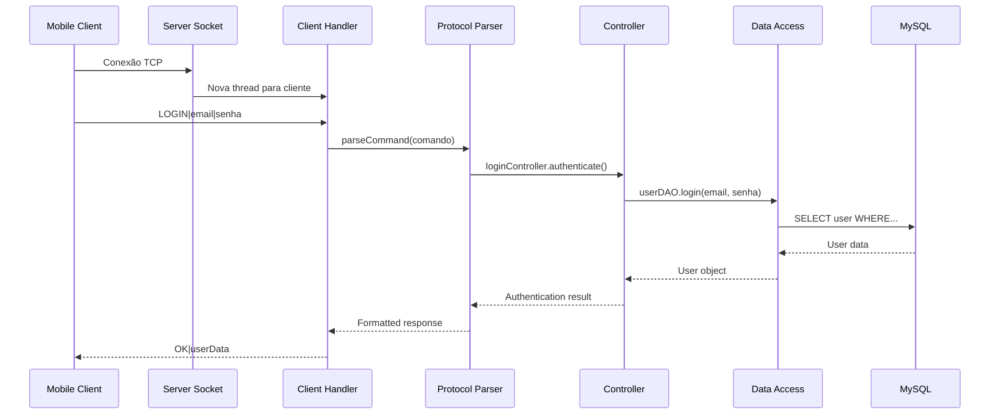
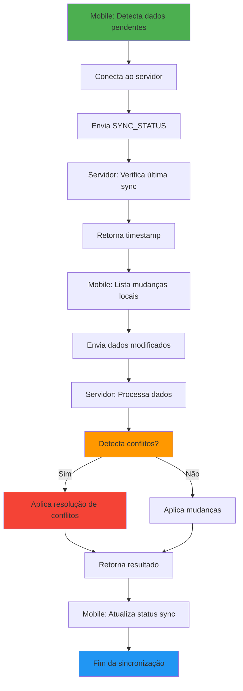

# 🏗️ Arquitetura do Sistema Finanza

## 📋 Índice

1. [Visão Geral da Arquitetura](#-visão-geral-da-arquitetura)
2. [Arquitetura Mobile (Android)](#-arquitetura-mobile-android)
3. [Arquitetura Desktop (Java)](#-arquitetura-desktop-java)
4. [Protocolo de Comunicação](#-protocolo-de-comunicação)
5. [Sincronização de Dados](#-sincronização-de-dados)
6. [Banco de Dados](#-banco-de-dados)
7. [Padrões de Design](#-padrões-de-design)
8. [Fluxos de Dados](#-fluxos-de-dados)

## 🌐 Visão Geral da Arquitetura

O sistema Finanza adota uma arquitetura híbrida cliente-servidor com sincronização bidirecional:



### 🎯 Princípios Arquiteturais

1. **Offline-First**: O mobile funciona completamente offline
2. **Eventual Consistency**: Dados sincronizados quando possível
3. **Conflict Resolution**: Resolução automática por timestamp
4. **Modularidade**: Componentes independentes e testáveis
5. **Escalabilidade**: Suporta múltiplos clientes simultâneos

## 📱 Arquitetura Mobile (Android)

### 🏗️ Estrutura em Camadas



### 🔧 Componentes Principais

#### 📊 **Presentation Layer**
- **Activities**: Telas da aplicação (Login, Main, Accounts, etc.)
- **Fragments**: Componentes reutilizáveis de UI
- **Adapters**: Ligação entre dados e views
- **ViewModels**: Gerenciamento de estado da UI

#### 🧠 **Business Layer**
- **AuthManager**: Gerencia autenticação híbrida (local + remota)
- **SyncService**: Coordena sincronização de dados
- **ServerClient**: Cliente TCP para comunicação com desktop
- **ConflictResolutionManager**: Resolve conflitos de sincronização

#### 💾 **Data Layer**
- **Room Database**: ORM local para SQLite
- **Entities**: Modelos de dados (Usuario, Conta, Categoria, Lancamento)
- **DAOs**: Data Access Objects para operações CRUD
- **Migrations**: Scripts de migração do banco

#### 🌐 **Network Layer**
- **Protocol**: Define formato de comunicação
- **TCP Client**: Implementação de socket cliente
- **Serialization**: Conversão de objetos para protocolo

### 📋 Detalhamento dos Componentes

#### 🔐 AuthManager
```java
/**
 * Gerencia autenticação híbrida:
 * 1. Verifica credenciais localmente (Room)
 * 2. Tenta autenticar no servidor (TCP)
 * 3. Fallback para modo offline
 * 4. Sincroniza dados após login
 */
public class AuthManager {
    // Singleton pattern
    // SharedPreferences para sessão
    // Integração com SyncService
}
```

#### 🔄 SyncService
```java
/**
 * Coordena sincronização bidirecional:
 * 1. Detecta dados pendentes (syncStatus = NEEDS_SYNC)
 * 2. Envia para servidor via ServerClient
 * 3. Recebe dados do servidor
 * 4. Resolve conflitos por timestamp
 * 5. Atualiza status de sincronização
 */
public class SyncService {
    // Executor para background tasks
    // Queue de operações pendentes
    // Callbacks para UI updates
}
```

## 🖥️ Arquitetura Desktop (Java)

### 🏗️ Padrão MVC



### 🔧 Componentes do Desktop

#### 👁️ **View Layer (Swing UI)**
- **JFrames**: Janelas principais da aplicação
- **JPanels**: Painéis para organização de componentes
- **JDialogs**: Caixas de diálogo modais
- **Custom Components**: Componentes personalizados

#### 🎮 **Controller Layer**
- **Processamento de Eventos**: ActionListeners, MouseListeners
- **Validação de Dados**: Validação de entrada do usuário
- **Coordenação**: Entre views e models
- **Business Logic**: Regras de negócio específicas

#### 📊 **Model Layer**
- **Entities**: Representação dos dados (User, Account, etc.)
- **Business Objects**: Objetos com lógica de negócio
- **Value Objects**: Objetos imutáveis para transferência

#### 💾 **Data Access Layer**
- **DAOs**: Padrão Data Access Object
- **JDBC**: Conectividade com MySQL
- **Transactions**: Controle transacional
- **Connection Pooling**: Pool de conexões

#### 🌐 **Network Server**
- **ServerSocket**: Aceita conexões TCP
- **ClientHandler**: Thread por cliente conectado
- **Protocol Handler**: Processa comandos do protocolo
- **Response Builder**: Constrói respostas padronizadas

## 🔗 Protocolo de Comunicação

### 📋 Formato do Protocolo

O protocolo utiliza separadores específicos para estruturar dados:

```
COMANDO|PARAM1|PARAM2|PARAM3
```

**Separadores:**
- `|` (pipe): Separador principal de comandos
- `;` (ponto e vírgula): Separador de campos em listas
- `,` (vírgula): Separador de dados individuais

### 📨 Tipos de Comandos

#### 🔐 **Autenticação**
```
LOGIN|email@example.com|senha123
REGISTER|Nome Completo|email@example.com|senha123
LOGOUT|userId
```

#### 👤 **Usuários**
```
GET_PERFIL|userId
UPDATE_PERFIL|userId|novoNome|novoEmail
CHANGE_PASSWORD|userId|senhaAtual|novaSenha
```

#### 💳 **Contas**
```
LIST_CONTAS|userId
ADD_CONTA|nome|tipo|saldoInicial|userId
UPDATE_CONTA|contaId|novoNome|novoTipo|novoSaldo
DELETE_CONTA|contaId
```

#### 🏷️ **Categorias**
```
LIST_CATEGORIAS|userId
LIST_CATEGORIAS_TIPO|tipo|userId
ADD_CATEGORIA|nome|tipo|cor|userId
UPDATE_CATEGORIA|categoriaId|novoNome|novaCor
DELETE_CATEGORIA|categoriaId
```

#### 💰 **Transações**
```
LIST_MOVIMENTACOES|userId
ADD_MOVIMENTACAO|valor|data|descricao|tipo|contaId|categoriaId|userId
UPDATE_MOVIMENTACAO|movimentacaoId|novoValor|novaDescricao
DELETE_MOVIMENTACAO|movimentacaoId
```

#### 🔄 **Sincronização Avançada**
```
SYNC_STATUS|userId
INCREMENTAL_SYNC|entityType|sinceTimestamp
BULK_UPLOAD|entityType|dataCount|data...
RESOLVE_CONFLICT|entityType|uuid|winnerTimestamp
```

### 📤 Formato de Respostas

#### ✅ **Sucesso**
```
OK|dados_da_resposta
OK|{"id": 123, "nome": "Conta Corrente"}
OK|lista;de;dados;separados
```

#### ❌ **Erro**
```
ERROR|mensagem_de_erro
INVALID_DATA|Campo obrigatório não informado
INVALID_CREDENTIALS|Email ou senha incorretos
NOT_FOUND|Recurso não encontrado
CONFLICT|Conflito de sincronização detectado
```

## 🔄 Sincronização de Dados

### 🎯 Estratégia de Sincronização



### 🔧 Metadados de Sincronização

Cada entidade possui campos para controle de sincronização:

```java
public class BaseEntity {
    public String uuid;           // UUID universal
    public long lastModified;     // Timestamp modificação
    public int syncStatus;        // Status sync (0-3)
    public long lastSyncTime;     // Último sync bem-sucedido
    public String serverHash;     // Hash para integridade
}
```

### 📊 Estados de Sincronização

| Status | Valor | Descrição |
|--------|--------|-----------|
| **LOCAL_ONLY** | 0 | Dados apenas locais |
| **SYNCED** | 1 | Sincronizado com servidor |
| **NEEDS_SYNC** | 2 | Precisa sincronizar |
| **CONFLICT** | 3 | Conflito detectado |

### ⚡ Resolução de Conflitos

```java
/**
 * Algoritmo de Resolução de Conflitos:
 * 1. Compara timestamps (lastModified)
 * 2. Versão mais recente vence
 * 3. Em caso de empate, servidor vence
 * 4. Usuário pode resolver manualmente
 */
public ConflictResolution resolveConflict(Entity local, Entity server) {
    if (local.lastModified > server.lastModified) {
        return ConflictResolution.USE_LOCAL;
    } else if (server.lastModified > local.lastModified) {
        return ConflictResolution.USE_SERVER;
    } else {
        return ConflictResolution.USE_SERVER; // Empate: servidor vence
    }
}
```

## 💾 Banco de Dados

### 📱 **Mobile (Room SQLite)**

```sql
-- Tabela Usuario
CREATE TABLE Usuario (
    id INTEGER PRIMARY KEY AUTOINCREMENT,
    nome TEXT NOT NULL,
    email TEXT UNIQUE NOT NULL,
    senha TEXT NOT NULL,
    dataCriacao INTEGER,
    uuid TEXT UNIQUE DEFAULT '',
    lastModified INTEGER DEFAULT 0,
    syncStatus INTEGER DEFAULT 2,
    lastSyncTime INTEGER DEFAULT 0
);

-- Tabela Conta
CREATE TABLE Conta (
    id INTEGER PRIMARY KEY AUTOINCREMENT,
    nome TEXT NOT NULL,
    tipo TEXT NOT NULL,
    saldoInicial REAL NOT NULL,
    saldoAtual REAL NOT NULL DEFAULT 0,
    usuarioId INTEGER NOT NULL,
    uuid TEXT UNIQUE DEFAULT '',
    lastModified INTEGER DEFAULT 0,
    syncStatus INTEGER DEFAULT 2,
    lastSyncTime INTEGER DEFAULT 0,
    FOREIGN KEY (usuarioId) REFERENCES Usuario(id)
);

-- Tabela Categoria
CREATE TABLE Categoria (
    id INTEGER PRIMARY KEY AUTOINCREMENT,
    nome TEXT NOT NULL,
    tipo TEXT NOT NULL CHECK (tipo IN ('receita', 'despesa')),
    cor TEXT DEFAULT '#2196F3',
    usuarioId INTEGER NOT NULL,
    uuid TEXT UNIQUE DEFAULT '',
    lastModified INTEGER DEFAULT 0,
    syncStatus INTEGER DEFAULT 2,
    lastSyncTime INTEGER DEFAULT 0,
    FOREIGN KEY (usuarioId) REFERENCES Usuario(id)
);

-- Tabela Lancamento
CREATE TABLE Lancamento (
    id INTEGER PRIMARY KEY AUTOINCREMENT,
    valor REAL NOT NULL,
    data INTEGER NOT NULL,
    descricao TEXT NOT NULL,
    tipo TEXT NOT NULL CHECK (tipo IN ('receita', 'despesa')),
    contaId INTEGER NOT NULL,
    categoriaId INTEGER NOT NULL,
    usuarioId INTEGER NOT NULL,
    uuid TEXT UNIQUE DEFAULT '',
    lastModified INTEGER DEFAULT 0,
    syncStatus INTEGER DEFAULT 2,
    lastSyncTime INTEGER DEFAULT 0,
    isDeleted INTEGER DEFAULT 0,
    FOREIGN KEY (contaId) REFERENCES Conta(id),
    FOREIGN KEY (categoriaId) REFERENCES Categoria(id),
    FOREIGN KEY (usuarioId) REFERENCES Usuario(id)
);
```

### 🖥️ **Desktop (MySQL)**

```sql
-- Schema similar ao SQLite, mas com tipos MySQL
CREATE TABLE usuarios (
    id INT AUTO_INCREMENT PRIMARY KEY,
    nome VARCHAR(255) NOT NULL,
    email VARCHAR(255) UNIQUE NOT NULL,
    senha VARCHAR(255) NOT NULL,
    data_criacao TIMESTAMP DEFAULT CURRENT_TIMESTAMP,
    uuid VARCHAR(36) UNIQUE,
    last_modified BIGINT DEFAULT 0,
    sync_status INT DEFAULT 1,
    last_sync_time BIGINT DEFAULT 0
);

-- Índices para performance
CREATE INDEX idx_usuario_uuid ON usuarios(uuid);
CREATE INDEX idx_usuario_email ON usuarios(email);
CREATE INDEX idx_usuario_sync ON usuarios(sync_status, last_modified);
```

### 🔗 **Relacionamentos**



## 🎨 Padrões de Design

### 🏗️ **Padrões Arquiteturais**

#### 📱 **Mobile (Android)**
- **MVP/MVVM**: Separação entre UI e lógica
- **Repository Pattern**: Abstração de fonte de dados
- **Observer Pattern**: Callbacks e LiveData
- **Singleton**: AuthManager, SyncService
- **Factory**: Database creation

#### 🖥️ **Desktop (Java)**
- **MVC**: Model-View-Controller clássico
- **DAO Pattern**: Data Access Objects
- **Command Pattern**: Processamento de comandos
- **Template Method**: Handlers de protocolo
- **Strategy Pattern**: Diferentes algoritmos de sync

### 🔧 **Padrões de Implementação**

#### 📊 **Data Transfer Objects (DTOs)**
```java
public class SyncDataDTO {
    private String entityType;
    private List<String> uuids;
    private long timestamp;
    private Map<String, Object> metadata;
}
```

#### 🎯 **Command Pattern para Protocolo**
```java
public interface ProtocolCommand {
    String execute(String[] params, ClientHandler client);
}

public class LoginCommand implements ProtocolCommand {
    @Override
    public String execute(String[] params, ClientHandler client) {
        // Implementação do login
    }
}
```

#### 🔄 **Observer Pattern para Sync**
```java
public interface SyncCallback {
    void onSyncStarted();
    void onSyncProgress(String operation);
    void onSyncCompleted(boolean success, String message);
}
```

## 🌊 Fluxos de Dados

### 📱 **Mobile - Fluxo de Adição de Transação**



### 🖥️ **Desktop - Fluxo de Processamento de Comando**



### 🔄 **Sincronização Completa**



## 🔧 Considerações de Performance

### 📱 **Mobile Optimizations**
- **Lazy Loading**: Carregamento sob demanda
- **Background Sync**: Sincronização em background
- **Data Pagination**: Paginação de listas grandes
- **Cache Strategy**: Cache inteligente de dados

### 🖥️ **Desktop Optimizations**
- **Connection Pooling**: Pool de conexões MySQL
- **Thread Pool**: Pool de threads para clientes
- **Batch Operations**: Operações em lote
- **Query Optimization**: Consultas otimizadas

### 🌐 **Network Optimizations**
- **Incremental Sync**: Apenas dados modificados
- **Compression**: Compressão de dados grandes
- **Retry Logic**: Lógica de retry inteligente
- **Circuit Breaker**: Proteção contra falhas

---

Esta documentação fornece uma visão completa da arquitetura do sistema Finanza, servindo como guia para desenvolvedores e mantenedores do projeto.