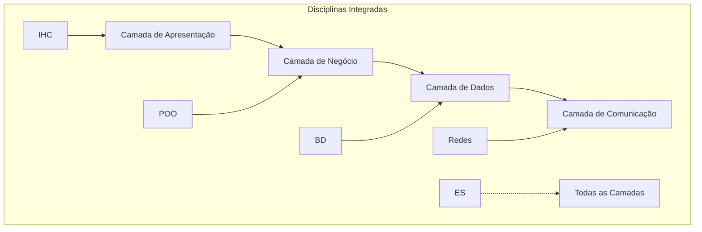

# Modelo de Trabalho Interdisciplinar
## Framework para Desenvolvimento de Projetos Integradores

---

## 📋 DEFINIÇÃO E OBJETIVOS

### **Conceito de Interdisciplinaridade**
O trabalho interdisciplinar é uma abordagem pedagógica que integra conhecimentos, metodologias e perspectivas de diferentes disciplinas para abordar problemas complexos de forma holística e abrangente.

### **Objetivos Principais**
- 🎯 **Integração de Conhecimentos**: Conectar conceitos de múltiplas disciplinas
- 🎯 **Aplicação Prática**: Implementar teorias em projetos reais
- 🎯 **Desenvolvimento de Competências**: Formar profissionais completos
- 🎯 **Resolução de Problemas**: Abordar desafios complexos multidisciplinares

---

## 🏗️ ESTRUTURA METODOLÓGICA

### **1. Fase de Planejamento**

#### 1.1 Identificação das Disciplinas
- **Disciplinas Obrigatórias**: Áreas core do curso
- **Disciplinas Complementares**: Áreas de apoio
- **Disciplinas Transversais**: Competências gerais

#### 1.2 Mapeamento de Competências
```
Competência = Conhecimento + Habilidade + Atitude
```

- **Conhecimentos**: Conceitos teóricos de cada disciplina
- **Habilidades**: Aplicação prática dos conceitos
- **Atitudes**: Postura profissional e ética

#### 1.3 Definição do Escopo
- Problema a ser resolvido
- Objetivos específicos de cada disciplina
- Resultados esperados
- Cronograma de desenvolvimento

### **2. Fase de Desenvolvimento**

#### 2.1 Metodologia Incremental
```
Incremento = Teoria + Prática + Validação + Documentação
```

**Vantagens**:
- ✅ Feedback contínuo
- ✅ Redução de riscos
- ✅ Entregas funcionais
- ✅ Adaptabilidade

#### 2.2 Integração Progressiva
- **Início**: Disciplinas independentes
- **Desenvolvimento**: Integração gradual
- **Finalização**: Sistema unificado

### **3. Fase de Validação**

#### 3.1 Critérios de Avaliação
- **Técnicos**: Funcionamento correto
- **Acadêmicos**: Aplicação dos conceitos
- **Profissionais**: Qualidade comercial
- **Interdisciplinares**: Integração efetiva

---

## 🎓 MATRIZ DE DISCIPLINAS

### **Disciplinas Core (Obrigatórias)**

| Disciplina | Contribuição | Aplicação Prática | Peso |
|------------|--------------|-------------------|------|
| **Programação Orientada a Objetos** | Modelagem e implementação | Classes, herança, polimorfismo | 25% |
| **Banco de Dados** | Persistência e consultas | Modelagem, SQL, transações | 20% |
| **Engenharia de Software** | Metodologia e qualidade | Processo, documentação, testes | 20% |
| **Redes de Computadores** | Comunicação distribuída | Protocolos, sockets, sincronização | 15% |

### **Disciplinas Complementares**

| Disciplina | Contribuição | Aplicação Prática | Peso |
|------------|--------------|-------------------|------|
| **Interface Humano-Computador** | Usabilidade e design | UI/UX, Material Design | 10% |
| **Sistemas Operacionais** | Plataforma e recursos | Threads, multiplataforma | 10% |

---

## 📊 METODOLOGIA DE INTEGRAÇÃO

### **Modelo de Integração em Camadas**



### **Processo de Integração**

#### **Fase 1: Fundamentação Teórica**
- Estudo individual de cada disciplina
- Identificação de pontos de integração
- Definição de interfaces entre áreas

#### **Fase 2: Implementação Incremental**
- Desenvolvimento modular por disciplina
- Integração progressiva dos módulos
- Testes de integração contínuos

#### **Fase 3: Validação Interdisciplinar**
- Verificação da aplicação correta dos conceitos
- Avaliação da qualidade da integração
- Documentação do processo e resultados

---

## 🔄 CICLO DE DESENVOLVIMENTO INTERDISCIPLINAR

### **1. Análise Interdisciplinar**
```
Problema Real → Decomposição por Disciplinas → Identificação de Interfaces
```

### **2. Design Integrado**
```
Arquitetura Geral → Módulos Disciplinares → Pontos de Integração
```

### **3. Implementação Coordenada**
```
Desenvolvimento Paralelo → Integração Contínua → Validação Incremental
```

### **4. Validação Holística**
```
Testes Funcionais → Testes de Integração → Validação Acadêmica
```

---

## 📋 TEMPLATE DE PROJETO INTERDISCIPLINAR

### **Documento de Visão**
1. **Descrição do Problema**
2. **Objetivos Acadêmicos**
3. **Disciplinas Envolvidas**
4. **Resultados Esperados**

### **Plano de Integração**
1. **Matriz de Disciplinas**
2. **Pontos de Integração**
3. **Cronograma de Desenvolvimento**
4. **Critérios de Avaliação**

### **Documentação Técnica**
1. **Arquitetura do Sistema**
2. **Especificações por Disciplina**
3. **Interfaces de Integração**
4. **Manual de Uso**

### **Relatório Final**
1. **Resultados Alcançados**
2. **Competências Desenvolvidas**
3. **Lições Aprendidas**
4. **Perspectivas Futuras**

---

## 🎯 COMPETÊNCIAS DESENVOLVIDAS

### **Competências Técnicas**
- ✅ **Programação**: Desenvolvimento de software robusto
- ✅ **Modelagem**: Design de sistemas e banco de dados
- ✅ **Redes**: Comunicação distribuída
- ✅ **Interfaces**: Design de experiência do usuário

### **Competências Metodológicas**
- ✅ **Gestão de Projetos**: Planejamento e execução
- ✅ **Documentação**: Comunicação técnica eficaz
- ✅ **Testes**: Validação e qualidade
- ✅ **Versionamento**: Controle de mudanças

### **Competências Transversais**
- ✅ **Trabalho em Equipe**: Colaboração efetiva
- ✅ **Resolução de Problemas**: Pensamento analítico
- ✅ **Comunicação**: Apresentação de resultados
- ✅ **Aprendizado Contínuo**: Adaptação a novas tecnologias

---

## 📊 CRITÉRIOS DE AVALIAÇÃO

### **Avaliação por Disciplina (70%)**

| Disciplina | Critérios Específicos | Peso |
|------------|----------------------|------|
| **POO** | Modelagem OO, padrões de design, qualidade do código | 25% |
| **BD** | Normalização, consultas eficientes, integridade | 20% |
| **ES** | Processo, documentação, testes, qualidade | 20% |
| **Redes** | Protocolo, sincronização, performance | 15% |
| **IHC** | Usabilidade, design, experiência do usuário | 10% |
| **SO** | Uso de recursos, multiplataforma | 10% |

### **Avaliação Interdisciplinar (30%)**
- **Integração Efetiva**: Qualidade da conexão entre disciplinas
- **Inovação**: Criatividade na solução do problema
- **Completude**: Abrangência do projeto
- **Aplicabilidade**: Relevância prática da solução

---

## 🚀 BENEFÍCIOS DA ABORDAGEM INTERDISCIPLINAR

### **Para o Aluno**
- 🎓 **Visão Holística**: Compreensão completa dos sistemas
- 🎓 **Competências Integradas**: Habilidades multidisciplinares
- 🎓 **Experiência Real**: Projetos com complexidade profissional
- 🎓 **Portfólio Robusto**: Trabalhos de qualidade comercial

### **Para a Instituição**
- 🏫 **Qualidade do Ensino**: Metodologia inovadora e eficaz
- 🏫 **Integração Curricular**: Conexão entre disciplinas
- 🏫 **Preparação Profissional**: Egresso mais preparado
- 🏫 **Visibilidade**: Projetos de destaque

### **Para o Mercado**
- 🏢 **Profissionais Completos**: Competências multidisciplinares
- 🏢 **Soluções Inovadoras**: Abordagem integrada de problemas
- 🏢 **Qualidade Técnica**: Formação robusta e prática
- 🏢 **Adaptabilidade**: Capacidade de aprendizado contínuo

---

## 📈 INDICADORES DE SUCESSO

### **Métricas Quantitativas**
- Taxa de integração entre disciplinas (> 80%)
- Qualidade técnica do código (> 85%)
- Completude da documentação (100%)
- Atendimento aos requisitos (100%)

### **Métricas Qualitativas**
- Inovação na solução proposta
- Aplicabilidade real do projeto
- Qualidade da integração disciplinar
- Desenvolvimento de competências transversais

---

## ✅ CONCLUSÕES E RECOMENDAÇÕES

### **Fatores de Sucesso**
1. ✅ **Planejamento Cuidadoso**: Definição clara de objetivos e escopo
2. ✅ **Integração Progressiva**: Desenvolvimento incremental com validação contínua
3. ✅ **Documentação Rigorosa**: Registro completo do processo e resultados
4. ✅ **Avaliação Multidimensional**: Critérios técnicos e interdisciplinares

### **Recomendações para Aplicação**
- 📋 Inicie com mapeamento detalhado das disciplinas envolvidas
- 📋 Defina interfaces claras entre as áreas de conhecimento
- 📋 Implemente de forma incremental com validação contínua
- 📋 Documente todo o processo de integração
- 📋 Avalie tanto aspectos técnicos quanto interdisciplinares

### **Perspectivas Futuras**
O modelo de trabalho interdisciplinar representa uma evolução natural do ensino superior, preparando profissionais mais completos e capazes de enfrentar os desafios complexos do mercado atual.

---

**Elaborado por**: Núcleo de Projetos Interdisciplinares  
**Aplicado em**: Sistema Finanza  
**Versão**: 2.0  
**Data**: 2025