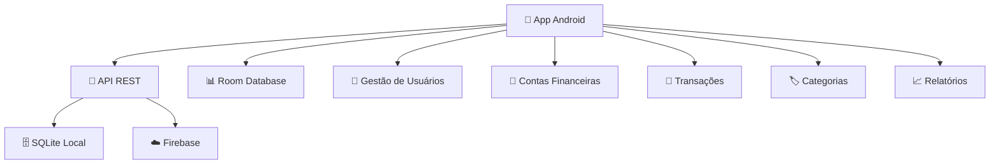

# 💰 Finanza - Sistema de Gestão Financeira Pessoal

<div align="center">


[](./app)
[](./server)
[](./FIREBASE_SETUP.md)
[](./database)

**Uma solução completa para gestão financeira pessoal com sincronização em nuvem**

[📚 Documentação](#-documentação) • [🚀 Instalação](#-instalação-rápida) • [📱 Features](#-funcionalidades) • [🔧 API](#-api) • [🤝 Contribuir](#-contribuição)

</div>

---

## 🌟 Visão Geral

O **Finanza** é um sistema completo de gestão financeira pessoal desenvolvido para ajudar usuários a controlar suas finanças de forma simples e eficiente. O projeto combina um app Android nativo com uma API REST robusta e sincronização em tempo real via Firebase.

### 🏗️ Arquitetura



## 🚀 Instalação Rápida

### ⚡ Setup Automático

```bash
git clone https://github.com/KallebySchultz/Finanza.git
cd Finanza
chmod +x setup.sh
./setup.sh
```

### 📋 Passo a Passo

1. **Pré-requisitos:**
   - Node.js 18+ 
   - Android Studio
   - Git

2. **Configurar Servidor:**
   ```bash
   cd server
   npm install
   npm start
   ```

3. **Configurar Android:**
   - Abrir projeto no Android Studio
   - Configurar IP do servidor
   - Executar no device/emulador

4. **Configurar Firebase:**
   - Seguir guia: [FIREBASE_SETUP.md](./FIREBASE_SETUP.md)

## 📱 Funcionalidades

### 👤 **Gestão de Usuários**
- ✅ Cadastro e autenticação segura
- ✅ Perfil personalizável
- ✅ Sistema de administração
- ✅ Segurança com JWT

### 🏦 **Contas Financeiras**
- ✅ Múltiplas contas (corrente, poupança, cartão)
- ✅ Saldo inicial e atual em tempo real
- ✅ Histórico completo de movimentações
- ✅ Edição e exclusão

### 📝 **Transações**
- ✅ Receitas e despesas
- ✅ Categorização inteligente
- ✅ Filtros avançados (data, tipo, categoria)
- ✅ Descrições personalizadas

### 🏷️ **Categorias**
- ✅ Categorias pré-definidas
- ✅ Cores personalizadas
- ✅ Criação de novas categorias
- ✅ Separação receitas/despesas

### 📈 **Relatórios e Análises**
- ✅ Dashboard com resumo financeiro
- ✅ Gráficos de gastos por categoria
- ✅ Análise por período
- ✅ Exportação de dados

### ☁️ **Sincronização**
- ✅ Backup automático na nuvem
- ✅ Acesso offline
- ✅ Sincronização entre dispositivos
- ✅ Resolução automática de conflitos

## 🔧 API

### 🌐 Endpoints Principais

| Módulo | Endpoint | Descrição |
|--------|----------|-----------|
| **Auth** | `POST /api/auth/login` | Login de usuário |
| **Auth** | `POST /api/auth/register` | Cadastro de usuário |
| **Users** | `GET /api/users/profile` | Perfil do usuário |
| **Users** | `GET /api/users/financial-summary` | Resumo financeiro |
| **Accounts** | `GET /api/accounts` | Listar contas |
| **Accounts** | `POST /api/accounts` | Criar conta |
| **Transactions** | `GET /api/transactions` | Listar transações |
| **Transactions** | `POST /api/transactions` | Criar transação |
| **Categories** | `GET /api/categories` | Listar categorias |

📖 **Documentação completa:** [API_DOCS.md](./API_DOCS.md)

### 🧪 Teste Rápido

```bash
# Health check
curl http://localhost:8080/api/health

# Criar usuário
curl -X POST http://localhost:8080/api/auth/register \
  -H "Content-Type: application/json" \
  -d '{"nome":"Teste","email":"teste@example.com","senha":"123456"}'
```

## 📊 Screenshots

<div align="center">

### 📱 App Android

| Login | Dashboard | Contas | Transações |
|-------|-----------|--------|------------|
|  |  |  |  |

</div>

## 🛠️ Tecnologias

### 🔧 Backend
- **Node.js** + Express.js
- **Firebase** Realtime Database
- **SQLite** para dados locais
- **JWT** para autenticação
- **Bcrypt** para senhas

### 📱 Frontend (Android)
- **Java** nativo
- **Room** Database
- **Material Design**
- **Retrofit** para API calls
- **Architecture Components**

### 🗄️ Banco de Dados
- **SQLite** (local)
- **Firebase** Realtime Database (nuvem)
- **Room** ORM (Android)

## 📚 Documentação

| Documento | Descrição |
|-----------|-----------|
| [📖 DESENVOLVIMENTO.md](./DESENVOLVIMENTO.md) | Guia completo de desenvolvimento |
| [🔌 API_DOCS.md](./API_DOCS.md) | Documentação da API REST |
| [🔥 FIREBASE_SETUP.md](./FIREBASE_SETUP.md) | Configuração do Firebase |
| [📱 Android Guide](./app/README.md) | Guia do app Android |

## 🎯 Roadmap

### 🚧 Em Desenvolvimento
- [ ] Dashboard avançado com gráficos
- [ ] Metas e orçamentos mensais
- [ ] Notificações push
- [ ] Exportação para PDF/Excel

### 💡 Futuras Features
- [ ] Múltiplas moedas
- [ ] Integração bancária
- [ ] Machine Learning para categorização
- [ ] App iOS
- [ ] Interface web

## 🧪 Testes

```bash
# Testar servidor
npm run test

# Testar Android (no Android Studio)
./gradlew test

# Health check da API
npm run health
```

## 🤝 Contribuição

Contribuições são muito bem-vindas! 

### 📝 Como Contribuir

1. **Fork** o projeto
2. **Clone** seu fork
3. **Crie** uma branch para sua feature
4. **Commit** suas mudanças
5. **Push** para a branch
6. **Abra** um Pull Request

### 🐛 Reportar Bugs

Use o [GitHub Issues](https://github.com/KallebySchultz/Finanza/issues) para reportar bugs ou sugerir features.

### 🎨 Guidelines

- Use nomes descritivos para commits
- Mantenha o código limpo e documentado
- Teste suas mudanças antes de enviar
- Siga os padrões de código existentes

## 📄 Licença

Este projeto está sob a licença **MIT**. Veja [LICENSE](./LICENSE) para detalhes.

## 👥 Time

- **[@KallebySchultz](https://github.com/KallebySchultz)** - Desenvolvedor Principal

## 🙏 Agradecimentos

- Comunidade Android
- Firebase Team  
- Node.js Community
- Todos os contribuidores

## 📞 Suporte

- 📧 **Email:** suporte@finanza.com
- 🐛 **Issues:** [GitHub Issues](https://github.com/KallebySchultz/Finanza/issues)
- 📖 **Docs:** [Documentação Completa](./DESENVOLVIMENTO.md)

---

<div align="center">

**Feito com ❤️ para ajudar você a controlar suas finanças**

⭐ **Se este projeto te ajudou, deixe uma estrela!** ⭐

[](https://github.com/KallebySchultz/Finanza/stargazers)

</div>