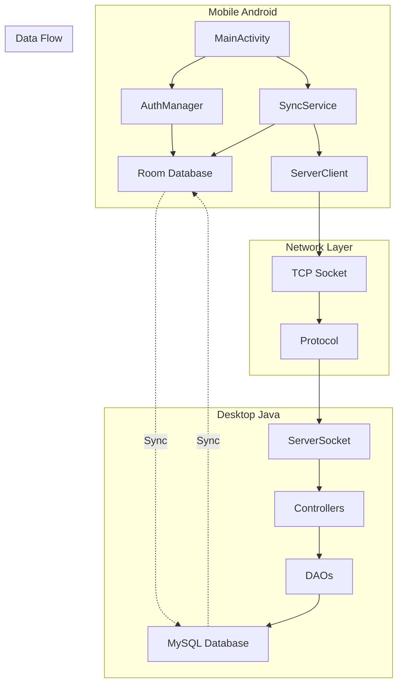

# 💰 Finanza - Sistema de Controle Financeiro

[](https://developer.android.com/)
[](https://www.java.com/)
[](https://www.mysql.com/)
[](https://socket.io/)

**Finanza** é um sistema completo de controle financeiro pessoal e empresarial que oferece aplicação móvel Android e aplicação desktop Java com sincronização em tempo real via sockets TCP.

## 🌟 Características Principais

### 📱 **Aplicação Móvel (Android)**
- **Offline-First**: Funciona completamente offline com sincronização automática
- **Interface Moderna**: Material Design com navegação intuitiva
- **Sincronização Inteligente**: Sincronização bidirecional com resolução de conflitos
- **Autenticação Híbrida**: Login local com sincronização remota opcional

### 🖥️ **Aplicação Desktop (Java)**
- **Servidor TCP**: Comunicação via sockets com o mobile
- **Interface Swing**: Interface gráfica robusta e responsiva
- **Banco MySQL**: Armazenamento confiável e escalável
- **Arquitetura MVC**: Código organizado e manutenível

### 🔄 **Sincronização Avançada**
- **Tempo Real**: Dados sincronizados instantaneamente entre dispositivos
- **Resolução de Conflitos**: Sistema automático por timestamp
- **UUID Universal**: Identificação única cross-platform
- **Sincronização Incremental**: Apenas dados modificados são transferidos

## 🏗️ Arquitetura do Sistema



## 📂 Estrutura do Projeto

```
Finanza-Mobile/
├── app/                                    # Aplicação Android
│   ├── src/main/java/com/example/finanza/
│   │   ├── MainActivity.java              # Tela principal do app
│   │   ├── db/                           # Banco de dados Room
│   │   │   ├── AppDatabase.java          # Configuração do BD
│   │   │   ├── UsuarioDao.java           # DAO de usuários
│   │   │   ├── ContaDao.java             # DAO de contas
│   │   │   ├── CategoriaDao.java         # DAO de categorias
│   │   │   └── LancamentoDao.java        # DAO de transações
│   │   ├── model/                        # Entidades do banco
│   │   │   ├── Usuario.java              # Entidade usuário
│   │   │   ├── Conta.java                # Entidade conta
│   │   │   ├── Categoria.java            # Entidade categoria
│   │   │   └── Lancamento.java           # Entidade transação
│   │   ├── network/                      # Camada de rede
│   │   │   ├── AuthManager.java          # Gerenciador de autenticação
│   │   │   ├── SyncService.java          # Serviço de sincronização
│   │   │   ├── ServerClient.java         # Cliente TCP
│   │   │   └── Protocol.java             # Protocolo de comunicação
│   │   ├── ui/                           # Interfaces de usuário
│   │   │   ├── LoginActivity.java        # Tela de login
│   │   │   ├── RegisterActivity.java     # Tela de registro
│   │   │   ├── AccountsActivity.java     # Gerenciar contas
│   │   │   ├── MovementsActivity.java    # Gerenciar transações
│   │   │   └── ProfileActivity.java      # Perfil do usuário
│   │   └── util/                         # Utilitários
│   └── src/main/res/                     # Recursos Android
├── DESKTOP VERSION/                       # Aplicação Desktop
│   ├── ClienteFinanza/                   # Cliente desktop
│   │   ├── controller/                   # Controllers MVC
│   │   ├── model/                        # Modelos de dados
│   │   ├── view/                         # Interface gráfica
│   │   └── util/                         # Utilitários
│   ├── ServidorFinanza/                  # Servidor desktop
│   │   ├── controller/                   # Controllers do servidor
│   │   ├── dao/                          # Data Access Objects
│   │   ├── model/                        # Modelos de dados
│   │   ├── server/                       # Lógica do servidor
│   │   └── util/                         # Utilitários
│   └── banco/                            # Scripts do banco
└── docs/                                 # Documentação

```

## 🚀 Funcionalidades

### ✅ **Implementadas**

#### 📱 Mobile
- [x] Sistema de autenticação (login/registro)
- [x] Dashboard principal com resumo financeiro
- [x] Gerenciamento de contas financeiras
- [x] Gerenciamento de categorias
- [x] Lançamentos de receitas e despesas
- [x] Sincronização em tempo real com desktop
- [x] Modo offline completo
- [x] Resolução automática de conflitos

#### 🖥️ Desktop
- [x] Servidor TCP para comunicação com mobile
- [x] Interface gráfica Swing
- [x] Banco de dados MySQL
- [x] Sistema de autenticação
- [x] CRUD completo de todas as entidades
- [x] Exportação de dados (CSV, HTML)
- [x] Relatórios financeiros

### 🔄 **Sincronização**
- [x] Protocolo customizado via TCP sockets
- [x] Sincronização bidirecional
- [x] Controle de conflitos por timestamp
- [x] UUIDs universais
- [x] Sincronização incremental
- [x] Fallback para modo offline

## 🛠️ Tecnologias Utilizadas

### 📱 **Mobile (Android)**
- **Java 11**: Linguagem principal
- **Android SDK 36**: Plataforma de desenvolvimento
- **Room Database**: ORM para SQLite
- **Material Design**: Interface moderna
- **Gradle**: Sistema de build

### 🖥️ **Desktop (Java)**
- **Java Swing**: Interface gráfica
- **MySQL**: Banco de dados
- **JDBC**: Conectividade com banco
- **Sockets TCP**: Comunicação de rede
- **Maven/Gradle**: Gerenciamento de dependências

### 🌐 **Comunicação**
- **TCP Sockets**: Comunicação direta mobile ↔ desktop
- **Protocolo Customizado**: Formato pipe-separated (|)
- **JSON**: Estruturação de dados complexos
- **UUID**: Identificação única universal

## 📋 Pré-requisitos

### 📱 **Para Mobile**
- Android Studio 4.0+
- Android SDK 24+ (Android 7.0)
- Java 11+
- Gradle 8.0+

### 🖥️ **Para Desktop**
- Java JDK 11+
- MySQL 8.0+
- IDE Java (NetBeans, IntelliJ, Eclipse)

## 🚀 Como Executar

### 📱 **Aplicação Mobile**

1. **Clone o repositório**
   ```bash
   git clone https://github.com/KallebySchultz/Finanza-Mobile.git
   cd Finanza-Mobile
   ```

2. **Abra no Android Studio**
   - Abra o Android Studio
   - Selecione "Open an existing project"
   - Navegue até a pasta do projeto

3. **Configure o emulador ou device**
   - Configure um AVD (Android Virtual Device) ou
   - Conecte um dispositivo Android via USB

4. **Execute o projeto**
   - Clique em "Run" ou pressione Shift + F10
   - O app será instalado no dispositivo/emulador

### 🖥️ **Aplicação Desktop**

1. **Configure o MySQL**
   ```sql
   CREATE DATABASE finanza_db;
   -- Execute os scripts em DESKTOP VERSION/banco/
   ```

2. **Configure a conexão**
   - Edite `DESKTOP VERSION/ServidorFinanza/src/util/DatabaseUtil.java`
   - Atualize URL, usuário e senha do MySQL

3. **Execute o Servidor**
   ```bash
   cd "DESKTOP VERSION"
   # Compile e execute ServidorFinanza
   javac -cp ".:lib/*" src/**/*.java
   java -cp ".:lib/*:src" MainServidor
   ```

4. **Execute o Cliente (opcional)**
   ```bash
   # Em outro terminal
   java -cp ".:lib/*:src" MainCliente
   ```

### 🔗 **Configuração de Sincronização**

1. **No Desktop**: Inicie o servidor (porta 8080 padrão)
2. **No Mobile**: Vá em Configurações → Servidor
3. **Configure**:
   - IP do servidor (ex: 192.168.1.100)
   - Porta: 8080
   - Teste a conexão

## 📖 Guia de Uso

### 📱 **Mobile - Primeiro Uso**

1. **Instalação e Registro**
   - Instale o aplicativo
   - Crie uma nova conta ou faça login
   - O app funciona offline por padrão

2. **Configuração Inicial**
   - Crie sua primeira conta bancária
   - Adicione categorias de receita e despesa
   - Configure sincronização com desktop (opcional)

3. **Uso Diário**
   - Adicione receitas e despesas pela tela principal
   - Visualize o dashboard com resumo financeiro
   - Gerencie contas e categorias conforme necessário

### 🖥️ **Desktop - Configuração**

1. **Primeira Execução**
   - Configure banco MySQL
   - Inicie o servidor
   - Crie usuário administrador

2. **Sincronização**
   - Aguarde conexões do mobile
   - Monitore logs de sincronização
   - Resolva conflitos se necessário

3. **Uso Avançado**
   - Exporte relatórios
   - Visualize gráficos
   - Gerencie usuários

## 🔧 Configuração Avançada

### 🌐 **Servidor TCP**

```java
// Configuração padrão em DatabaseUtil.java
private static final String DB_URL = "jdbc:mysql://localhost:3306/finanza_db";
private static final String DB_USER = "root";
private static final String DB_PASSWORD = "";

// Configuração de rede em ServerSocket
private static final int PORT = 8080;
```

### 📱 **Mobile - Configurações**

```java
// AuthManager - Configurações de autenticação
private static final String PREFS_NAME = "FinanzaAuth";

// SyncService - Configurações de sincronização
private static final int SYNC_TIMEOUT = 30000; // 30 segundos
private static final int RETRY_ATTEMPTS = 3;
```

## 🔐 Segurança

### 🛡️ **Recursos de Segurança**
- **Senhas Criptografadas**: SHA-256 para armazenamento
- **Validação de Dados**: Cliente e servidor
- **Sessão Segura**: Tokens de autenticação
- **Comunicação Local**: TCP apenas em rede local

### ⚠️ **Considerações**
- Comunicação atual sem criptografia (adequado para rede local)
- Para produção: implementar TLS/SSL
- Backup regular do banco de dados recomendado

## 🐛 Solução de Problemas

### 📱 **Mobile Common Issues**

**App não conecta ao servidor**
```
1. Verifique se o servidor desktop está rodando
2. Confirme IP e porta nas configurações
3. Teste conectividade de rede (ping)
4. Verifique firewall/antivírus
```

**Dados não sincronizam**
```
1. Verifique status de conexão (indicador verde)
2. Force sincronização manual nas configurações
3. Reinicie o aplicativo
4. Verifique logs no servidor
```

### 🖥️ **Desktop Common Issues**

**Erro de conexão MySQL**
```
1. Verifique se MySQL está rodando
2. Confirme credenciais em DatabaseUtil.java
3. Teste conexão com MySQL Workbench
4. Verifique se database existe
```

**Erro na porta TCP**
```
1. Porta 8080 pode estar em uso
2. Altere porta no código se necessário
3. Configure firewall para liberar porta
4. Reinicie aplicação
```

## 📊 Monitoramento e Logs

### 📱 **Mobile Logs**
```java
// Tags de log para debug
Log.d("MainActivity", "Sincronização iniciada");
Log.d("AuthManager", "Login bem-sucedido");
Log.d("SyncService", "Dados sincronizados");
```

### 🖥️ **Desktop Logs**
```java
// Logs do servidor
System.out.println("Cliente conectado: " + socket.getRemoteSocketAddress());
System.out.println("Comando recebido: " + comando);
```

## 🚧 Desenvolvimento e Contribuição

### 🔧 **Setup de Desenvolvimento**

1. **Clone e configure**
   ```bash
   git clone https://github.com/KallebySchultz/Finanza-Mobile.git
   cd Finanza-Mobile
   ```

2. **Configuração IDE**
   - Android Studio para mobile
   - NetBeans/IntelliJ para desktop
   - Configure formatação de código

3. **Banco de dados de desenvolvimento**
   ```sql
   CREATE DATABASE finanza_dev;
   -- Use dados de teste
   ```

### 📝 **Padrões de Código**

- **Java Code Style**: Google Java Style Guide
- **Android**: Material Design Guidelines
- **Commits**: Conventional Commits
- **Documentação**: JavaDoc para todos os métodos públicos

### 🤝 **Como Contribuir**

1. Fork o projeto
2. Crie uma branch para sua feature (`git checkout -b feature/AmazingFeature`)
3. Commit suas mudanças (`git commit -m 'Add some AmazingFeature'`)
4. Push para a branch (`git push origin feature/AmazingFeature`)
5. Abra um Pull Request

## 📈 Roadmap

### 🔮 **Próximas Funcionalidades**
- [ ] Criptografia TLS/SSL para comunicação
- [ ] Notificações push em tempo real
- [ ] Sincronização multi-dispositivo
- [ ] Backup e restore automático
- [ ] Interface web responsiva
- [ ] APIs REST para integração
- [ ] Relatórios avançados com gráficos
- [ ] Exportação para diversos formatos

### 🎯 **Melhorias Planejadas**
- [ ] Performance de sincronização
- [ ] Interface do usuário aprimorada
- [ ] Testes automatizados
- [ ] CI/CD pipeline
- [ ] Documentação expandida

## 📄 Licença

Este projeto está licenciado sob a licença MIT - veja o arquivo [LICENSE](LICENSE) para detalhes.

## 👥 Equipe

- **Desenvolvimento**: Kalleby Schultz
- **Arquitetura**: Finanza Team
- **Documentação**: Finanza Team

## 📞 Suporte

- 🐛 **Issues**: [GitHub Issues](https://github.com/KallebySchultz/Finanza-Mobile/issues)
- 📧 **Email**: [email de suporte]
- 💬 **Discussões**: [GitHub Discussions](https://github.com/KallebySchultz/Finanza-Mobile/discussions)

---

<div align="center">

**Feito com ❤️ pela equipe Finanza**

[⬆ Voltar ao topo](#-finanza---sistema-de-controle-financeiro)

</div>