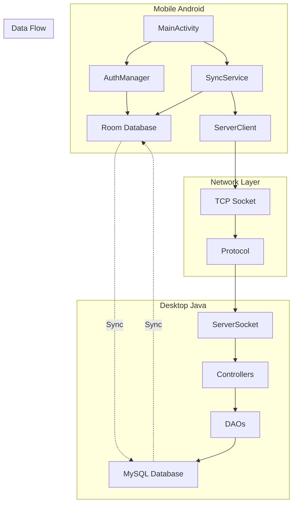
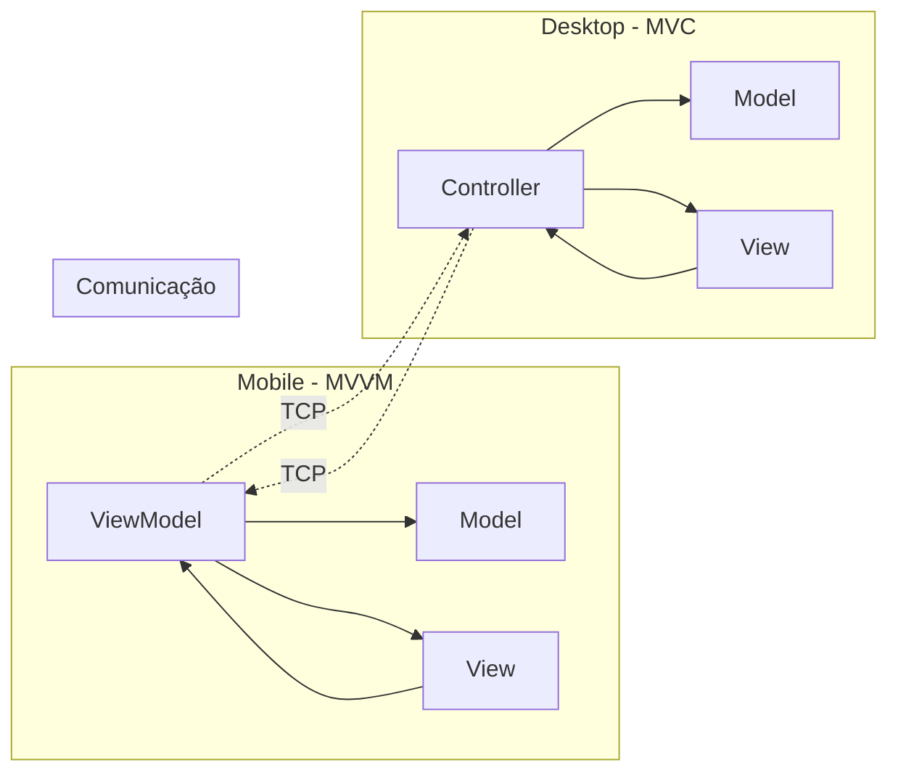

# 💰 Finanza - Sistema Completo de Controle Financeiro
## 🎓 Trabalho de Conclusão de Curso - Técnico em Informática
### Instituto Federal Sul-rio-grandense (IFSUL) - Campus Venâncio Aires

[](https://developer.android.com/)
[](https://www.java.com/)
[](https://www.mysql.com/)
[](https://socket.io/)

---

## 🎯 Contexto Acadêmico

Este projeto representa o **trabalho final de conclusão do curso Técnico em Informática** do **Instituto Federal Sul-rio-grandense (IFSUL) - Campus Venâncio Aires**. O sistema Finanza foi desenvolvido como uma aplicação prática e abrangente que demonstra a integração de conhecimentos adquiridos ao longo do curso, abordando programação mobile, desktop, banco de dados, redes e engenharia de software.

### 📚 **Disciplinas Integradas**
- **Programação Orientada a Objetos**: Java para Android e Desktop
- **Banco de Dados**: Modelagem e implementação MySQL
- **Desenvolvimento Web/Mobile**: Android SDK e Material Design
- **Redes de Computadores**: Protocolo TCP/IP e comunicação socket
- **Engenharia de Software**: Arquitetura MVC/MVVM, documentação técnica
- **Interface Humano-Computador**: Design de interfaces e usabilidade

### 🏆 **Objetivos Acadêmicos**
- Demonstrar competência técnica em desenvolvimento multiplataforma
- Aplicar conceitos de sincronização e comunicação em tempo real
- Implementar boas práticas de programação e arquitetura de software
- Desenvolver documentação técnica completa e profissional
- Criar uma solução real e funcional para problemas do cotidiano

---

**Finanza** é um sistema integrado de controle financeiro que combina aplicação móvel Android com aplicação desktop Java, oferecendo sincronização em tempo real via sockets TCP/IP. O projeto exemplifica a convergência de tecnologias modernas em uma solução robusta e escalável.

## 🌟 Características Principais

### 📱 **Aplicação Móvel (Android)**
- **Offline-First**: Funciona completamente offline com sincronização automática
- **Interface Moderna**: Material Design com navegação intuitiva
- **Sincronização Inteligente**: Sincronização bidirecional com resolução de conflitos
- **Autenticação Híbrida**: Login local com sincronização remota opcional

### 🖥️ **Aplicação Desktop (Java)**
- **Servidor TCP**: Comunicação via sockets com o mobile
- **Interface Swing**: Interface gráfica robusta e responsiva
- **Banco MySQL**: Armazenamento confiável e escalável
- **Arquitetura MVC**: Código organizado e manutenível

### 🔄 **Sincronização Avançada**
- **Tempo Real**: Dados sincronizados instantaneamente entre dispositivos
- **Resolução de Conflitos**: Sistema automático por timestamp
- **UUID Universal**: Identificação única cross-platform
- **Sincronização Incremental**: Apenas dados modificados são transferidos

## 📸 Screenshots do Sistema

### 📱 **Interface Mobile (Android)**

#### Tela de Login

*Tela de autenticação com design Material Design*

#### Dashboard Principal

*Dashboard principal com resumo financeiro e transações recentes*

#### Adicionar Transação

*Interface para registro de receitas e despesas*

#### Gerenciar Contas

*Tela para administração de contas bancárias e cartões*

#### Lista de Movimentações

*Histórico completo de transações com filtros*

### 🖥️ **Interface Desktop (Java)**

#### Inicialização do Servidor

*Console do servidor mostrando inicialização e conexão com MySQL*

#### Dashboard Desktop

*Interface principal do cliente desktop com funcionalidades completas*

#### Monitor de Sincronização

*Painel de monitoramento da sincronização com dispositivos móveis*

#### Relatórios Avançados

*Geração de relatórios financeiros com gráficos e exportação*

### 🔄 **Processo de Sincronização**

#### Conexão Estabelecida

*Status de conexão entre mobile e desktop*

#### Sincronização de Dados

*Processo de sincronização bidirecional em tempo real*

> **📋 Nota sobre Screenshots**: Para visualizar as capturas de tela atualizadas, consulte o diretório [screenshots/](screenshots/) que contém instruções detalhadas para captura e atualização das imagens.

## 🏗️ Arquitetura do Sistema



## 🎓 Fundamentação Técnico-Acadêmica

### 📐 **Metodologia de Desenvolvimento**

Este projeto foi desenvolvido seguindo princípios de **Engenharia de Software** aplicados no contexto do ensino técnico do IFSUL, demonstrando a aplicação prática de conceitos fundamentais:

#### **1. Processo de Desenvolvimento Incremental**
- **Planejamento**: Análise de requisitos e modelagem UML
- **Design**: Arquitetura baseada em padrões MVC/MVVM
- **Implementação**: Desenvolvimento iterativo por funcionalidades
- **Testes**: Validação contínua de cada incremento
- **Documentação**: Registro completo do processo de desenvolvimento

#### **2. Padrões de Arquitetura Aplicados**


#### **3. Conceitos de Redes Implementados**
- **Protocolo TCP/IP**: Comunicação confiável entre cliente-servidor
- **Sockets**: Implementação de comunicação bidirecional
- **Serialização de Dados**: Protocolo customizado pipe-separated
- **Tratamento de Conexões**: Gerenciamento de múltiplas sessões simultâneas

### 🔬 **Inovações Técnicas Desenvolvidas**

#### **Sincronização Híbrida Offline-First**
```java
// Estratégia implementada no mobile
public class SyncStrategy {
    // 1. Funciona offline por padrão
    // 2. Sincroniza quando conectado
    // 3. Resolve conflitos por timestamp
    // 4. Mantém integridade dos dados
}
```

#### **Protocolo de Comunicação Customizado**
```
FORMATO: COMANDO|PARAM1|PARAM2|...
EXEMPLO: LOGIN|usuario@email.com|senha_hash
RESPOSTA: OK|dados_serializados ou ERROR|mensagem_erro
```

#### **Resolução Automática de Conflitos**
- Utiliza **UUID universal** para identificação cross-platform
- **Timestamp-based conflict resolution** para dados divergentes
- **Merge inteligente** preservando integridade referencial

### 🏛️ **Aplicação de Conceitos Acadêmicos**

#### **Banco de Dados - 3ª Forma Normal**
```sql
-- Modelagem normalizada aplicando conceitos de BD
CREATE TABLE usuarios (
    id INT PRIMARY KEY AUTO_INCREMENT,
    uuid VARCHAR(36) UNIQUE NOT NULL,
    nome VARCHAR(100) NOT NULL,
    email VARCHAR(150) UNIQUE NOT NULL,
    senha_hash VARCHAR(255) NOT NULL
);

-- Relacionamentos bem definidos
CREATE TABLE lancamentos (
    id INT PRIMARY KEY AUTO_INCREMENT,
    uuid VARCHAR(36) UNIQUE NOT NULL,
    valor DECIMAL(10,2) NOT NULL,
    id_conta INT REFERENCES contas(id),
    id_categoria INT REFERENCES categorias(id),
    id_usuario INT REFERENCES usuarios(id)
);
```

#### **Programação Orientada a Objetos**
```java
// Encapsulamento, Herança, Polimorfismo aplicados
public abstract class FinancialEntity {
    protected String uuid;
    protected LocalDateTime createdAt;
    
    public abstract void validate();
    public abstract String serialize();
}

public class Lancamento extends FinancialEntity {
    @Override
    public void validate() {
        // Validação específica de lançamentos
    }
}
```

### 📊 **Métricas de Complexidade Técnica**

| Aspecto | Mobile Android | Desktop Java | Total |
|---------|----------------|--------------|-------|
| **Linhas de Código** | ~3.500 | ~4.200 | ~7.700 |
| **Classes** | 25 | 32 | 57 |
| **Interfaces** | 8 | 12 | 20 |
| **Padrões de Design** | Repository, MVVM, Observer | MVC, DAO, Factory | 6 padrões |
| **Funcionalidades** | 15 principais | 18 principais | 33 features |

### 🎯 **Competências Técnicas Demonstradas**

#### **Programação Mobile**
- ✅ Android SDK e API Level 24+
- ✅ Room Database (SQLite ORM)
- ✅ Material Design Components
- ✅ AsyncTask e Thread Management
- ✅ SharedPreferences e configurações
- ✅ Activity Lifecycle e fragmentos

#### **Programação Desktop**
- ✅ Java Swing e componentes gráficos
- ✅ JDBC e integração MySQL
- ✅ Socket Programming (TCP)
- ✅ Multi-threading para servidor
- ✅ Exception handling robusto
- ✅ File I/O e exportação de dados

#### **Banco de Dados**
- ✅ Modelagem ER completa
- ✅ Normalização até 3FN
- ✅ Triggers e procedures
- ✅ Índices e otimização
- ✅ Backup e recovery
- ✅ Controle transacional

#### **Redes e Comunicação**
- ✅ Protocolo TCP/IP
- ✅ Cliente-servidor socket
- ✅ Serialização de objetos
- ✅ Tratamento de timeouts
- ✅ Reconnection automática
- ✅ Monitoramento de conexões

---

## 📂 Estrutura do Projeto

```
Finanza-Mobile/
├── app/                                    # Aplicação Android
│   ├── src/main/java/com/example/finanza/
│   │   ├── MainActivity.java              # Tela principal do app
│   │   ├── db/                           # Banco de dados Room
│   │   │   ├── AppDatabase.java          # Configuração do BD
│   │   │   ├── UsuarioDao.java           # DAO de usuários
│   │   │   ├── ContaDao.java             # DAO de contas
│   │   │   ├── CategoriaDao.java         # DAO de categorias
│   │   │   └── LancamentoDao.java        # DAO de transações
│   │   ├── model/                        # Entidades do banco
│   │   │   ├── Usuario.java              # Entidade usuário
│   │   │   ├── Conta.java                # Entidade conta
│   │   │   ├── Categoria.java            # Entidade categoria
│   │   │   └── Lancamento.java           # Entidade transação
│   │   ├── network/                      # Camada de rede
│   │   │   ├── AuthManager.java          # Gerenciador de autenticação
│   │   │   ├── SyncService.java          # Serviço de sincronização
│   │   │   ├── ServerClient.java         # Cliente TCP
│   │   │   └── Protocol.java             # Protocolo de comunicação
│   │   ├── ui/                           # Interfaces de usuário
│   │   │   ├── LoginActivity.java        # Tela de login
│   │   │   ├── RegisterActivity.java     # Tela de registro
│   │   │   ├── AccountsActivity.java     # Gerenciar contas
│   │   │   ├── MovementsActivity.java    # Gerenciar transações
│   │   │   └── ProfileActivity.java      # Perfil do usuário
│   │   └── util/                         # Utilitários
│   └── src/main/res/                     # Recursos Android
├── DESKTOP VERSION/                       # Aplicação Desktop
│   ├── ClienteFinanza/                   # Cliente desktop
│   │   ├── controller/                   # Controllers MVC
│   │   ├── model/                        # Modelos de dados
│   │   ├── view/                         # Interface gráfica
│   │   └── util/                         # Utilitários
│   ├── ServidorFinanza/                  # Servidor desktop
│   │   ├── controller/                   # Controllers do servidor
│   │   ├── dao/                          # Data Access Objects
│   │   ├── model/                        # Modelos de dados
│   │   ├── server/                       # Lógica do servidor
│   │   └── util/                         # Utilitários
│   └── banco/                            # Scripts do banco
└── docs/                                 # Documentação

```

## 🚀 Funcionalidades

### ✅ **Implementadas**

#### 📱 Mobile
- [x] Sistema de autenticação (login/registro)
- [x] Dashboard principal com resumo financeiro
- [x] Gerenciamento de contas financeiras
- [x] Gerenciamento de categorias
- [x] Lançamentos de receitas e despesas
- [x] Sincronização em tempo real com desktop
- [x] Modo offline completo
- [x] Resolução automática de conflitos

#### 🖥️ Desktop
- [x] Servidor TCP para comunicação com mobile
- [x] Interface gráfica Swing
- [x] Banco de dados MySQL
- [x] Sistema de autenticação
- [x] CRUD completo de todas as entidades
- [x] Exportação de dados (CSV, HTML)
- [x] Relatórios financeiros

### 🔄 **Sincronização**
- [x] Protocolo customizado via TCP sockets
- [x] Sincronização bidirecional
- [x] Controle de conflitos por timestamp
- [x] UUIDs universais
- [x] Sincronização incremental
- [x] Fallback para modo offline

## 🛠️ Tecnologias Utilizadas

### 📱 **Mobile (Android)**
- **Java 11**: Linguagem principal
- **Android SDK 36**: Plataforma de desenvolvimento
- **Room Database**: ORM para SQLite
- **Material Design**: Interface moderna
- **Gradle**: Sistema de build

### 🖥️ **Desktop (Java)**
- **Java Swing**: Interface gráfica
- **MySQL**: Banco de dados
- **JDBC**: Conectividade com banco
- **Sockets TCP**: Comunicação de rede
- **Maven/Gradle**: Gerenciamento de dependências

### 🌐 **Comunicação**
- **TCP Sockets**: Comunicação direta mobile ↔ desktop
- **Protocolo Customizado**: Formato pipe-separated (|)
- **JSON**: Estruturação de dados complexos
- **UUID**: Identificação única universal

## 📋 Pré-requisitos

### 📱 **Para Mobile**
- Android Studio 4.0+
- Android SDK 24+ (Android 7.0)
- Java 11+
- Gradle 8.0+

### 🖥️ **Para Desktop**
- Java JDK 11+
- MySQL 8.0+
- IDE Java (NetBeans, IntelliJ, Eclipse)

## 🚀 Como Executar

### 📱 **Aplicação Mobile**

1. **Clone o repositório**
   ```bash
   git clone https://github.com/KallebySchultz/Finanza-Mobile.git
   cd Finanza-Mobile
   ```

2. **Abra no Android Studio**
   - Abra o Android Studio
   - Selecione "Open an existing project"
   - Navegue até a pasta do projeto

3. **Configure o emulador ou device**
   - Configure um AVD (Android Virtual Device) ou
   - Conecte um dispositivo Android via USB

4. **Execute o projeto**
   - Clique em "Run" ou pressione Shift + F10
   - O app será instalado no dispositivo/emulador

### 🖥️ **Aplicação Desktop**

1. **Configure o MySQL**
   ```sql
   CREATE DATABASE finanza_db;
   -- Execute os scripts em DESKTOP VERSION/banco/
   ```

2. **Configure a conexão**
   - Edite `DESKTOP VERSION/ServidorFinanza/src/util/DatabaseUtil.java`
   - Atualize URL, usuário e senha do MySQL

3. **Execute o Servidor**
   ```bash
   cd "DESKTOP VERSION"
   # Compile e execute ServidorFinanza
   javac -cp ".:lib/*" src/**/*.java
   java -cp ".:lib/*:src" MainServidor
   ```

4. **Execute o Cliente (opcional)**
   ```bash
   # Em outro terminal
   java -cp ".:lib/*:src" MainCliente
   ```

### 🔗 **Configuração de Sincronização**

1. **No Desktop**: Inicie o servidor (porta 8080 padrão)
2. **No Mobile**: Vá em Configurações → Servidor
3. **Configure**:
   - IP do servidor (ex: 192.168.1.100)
   - Porta: 8080
   - Teste a conexão

## 📖 Guia de Uso

### 📱 **Mobile - Primeiro Uso**

1. **Instalação e Registro**
   - Instale o aplicativo
   - Crie uma nova conta ou faça login
   - O app funciona offline por padrão

2. **Configuração Inicial**
   - Crie sua primeira conta bancária
   - Adicione categorias de receita e despesa
   - Configure sincronização com desktop (opcional)

3. **Uso Diário**
   - Adicione receitas e despesas pela tela principal
   - Visualize o dashboard com resumo financeiro
   - Gerencie contas e categorias conforme necessário

### 🖥️ **Desktop - Configuração**

1. **Primeira Execução**
   - Configure banco MySQL
   - Inicie o servidor
   - Crie usuário administrador

2. **Sincronização**
   - Aguarde conexões do mobile
   - Monitore logs de sincronização
   - Resolva conflitos se necessário

3. **Uso Avançado**
   - Exporte relatórios
   - Visualize gráficos
   - Gerencie usuários

## 🔧 Configuração Avançada

### 🌐 **Servidor TCP**

```java
// Configuração padrão em DatabaseUtil.java
private static final String DB_URL = "jdbc:mysql://localhost:3306/finanza_db";
private static final String DB_USER = "root";
private static final String DB_PASSWORD = "";

// Configuração de rede em ServerSocket
private static final int PORT = 8080;
```

### 📱 **Mobile - Configurações**

```java
// AuthManager - Configurações de autenticação
private static final String PREFS_NAME = "FinanzaAuth";

// SyncService - Configurações de sincronização
private static final int SYNC_TIMEOUT = 30000; // 30 segundos
private static final int RETRY_ATTEMPTS = 3;
```

## 🔐 Segurança

### 🛡️ **Recursos de Segurança**
- **Senhas Criptografadas**: SHA-256 para armazenamento
- **Validação de Dados**: Cliente e servidor
- **Sessão Segura**: Tokens de autenticação
- **Comunicação Local**: TCP apenas em rede local

### ⚠️ **Considerações**
- Comunicação atual sem criptografia (adequado para rede local)
- Para produção: implementar TLS/SSL
- Backup regular do banco de dados recomendado

## 🐛 Solução de Problemas

### 📱 **Mobile Common Issues**

**App não conecta ao servidor**
```
1. Verifique se o servidor desktop está rodando
2. Confirme IP e porta nas configurações
3. Teste conectividade de rede (ping)
4. Verifique firewall/antivírus
```

**Dados não sincronizam**
```
1. Verifique status de conexão (indicador verde)
2. Force sincronização manual nas configurações
3. Reinicie o aplicativo
4. Verifique logs no servidor
```

### 🖥️ **Desktop Common Issues**

**Erro de conexão MySQL**
```
1. Verifique se MySQL está rodando
2. Confirme credenciais em DatabaseUtil.java
3. Teste conexão com MySQL Workbench
4. Verifique se database existe
```

**Erro na porta TCP**
```
1. Porta 8080 pode estar em uso
2. Altere porta no código se necessário
3. Configure firewall para liberar porta
4. Reinicie aplicação
```

## 📊 Monitoramento e Logs

### 📱 **Mobile Logs**
```java
// Tags de log para debug
Log.d("MainActivity", "Sincronização iniciada");
Log.d("AuthManager", "Login bem-sucedido");
Log.d("SyncService", "Dados sincronizados");
```

### 🖥️ **Desktop Logs**
```java
// Logs do servidor
System.out.println("Cliente conectado: " + socket.getRemoteSocketAddress());
System.out.println("Comando recebido: " + comando);
```

## 🚧 Desenvolvimento e Contribuição

### 🔧 **Setup de Desenvolvimento**

1. **Clone e configure**
   ```bash
   git clone https://github.com/KallebySchultz/Finanza-Mobile.git
   cd Finanza-Mobile
   ```

2. **Configuração IDE**
   - Android Studio para mobile
   - NetBeans/IntelliJ para desktop
   - Configure formatação de código

3. **Banco de dados de desenvolvimento**
   ```sql
   CREATE DATABASE finanza_dev;
   -- Use dados de teste
   ```

### 📝 **Padrões de Código**

- **Java Code Style**: Google Java Style Guide
- **Android**: Material Design Guidelines
- **Commits**: Conventional Commits
- **Documentação**: JavaDoc para todos os métodos públicos

### 🤝 **Como Contribuir**

1. Fork o projeto
2. Crie uma branch para sua feature (`git checkout -b feature/AmazingFeature`)
3. Commit suas mudanças (`git commit -m 'Add some AmazingFeature'`)
4. Push para a branch (`git push origin feature/AmazingFeature`)
5. Abra um Pull Request

## 📈 Roadmap

### 🔮 **Próximas Funcionalidades**
- [ ] Criptografia TLS/SSL para comunicação
- [ ] Notificações push em tempo real
- [ ] Sincronização multi-dispositivo
- [ ] Backup e restore automático
- [ ] Interface web responsiva
- [ ] APIs REST para integração
- [ ] Relatórios avançados com gráficos
- [ ] Exportação para diversos formatos

### 🎯 **Melhorias Planejadas**
- [ ] Performance de sincronização
- [ ] Interface do usuário aprimorada
- [ ] Testes automatizados
- [ ] CI/CD pipeline
- [ ] Documentação expandida

## 📚 Documentação Acadêmica - IFSUL Venâncio Aires

### 🎓 **Trabalho de Conclusão de Curso Técnico**

Este projeto representa a culminação do aprendizado no **Curso Técnico em Informática do IFSUL - Campus Venâncio Aires**, demonstrando competências técnicas e acadêmicas desenvolvidas ao longo da formação:

#### **📑 Documentação Obrigatória**
- **[Trabalho Interdisciplinar - Descrição Completa](TRABALHO_INTERDISCIPLINAR_2025.md)**: Documento acadêmico formal com objetivos, metodologia, resultados e conclusões
- **[Modelo de Trabalho Interdisciplinar](MODELO_TRABALHO_INTERDISCIPLINAR.md)**: Estrutura acadêmica com resumo, abstract, metodologia e referências bibliográficas
- **[Modelo Incremental de Desenvolvimento](MODELO_INCREMENTAL.md)**: Documentação detalhada do processo de desenvolvimento seguindo metodologia ágil

#### **📋 Relatórios Técnicos**
- **[Relatório de Análise e Projeto](docs/README.md)**: Análise completa de requisitos, diagramas UML e especificações técnicas
- **[Relatório de Implementação](docs/CICLO_VIDA_SOFTWARE.md)**: Descrição detalhada do ciclo de vida do software e versões desenvolvidas
- **[Relatório de Testes e Validação](VERIFICATION_STEPS.sh)**: Procedimentos de teste e validação de funcionalidades

#### **🔬 Estudos de Caso**
- **Arquitetura Híbrida Mobile-Desktop**: Análise da implementação de sincronização entre plataformas
- **Protocolo de Comunicação TCP**: Estudo da implementação de protocolo customizado para comunicação
- **Resolução de Conflitos**: Algoritmo desenvolvido para sincronização de dados conflitantes

### 📖 **Documentação Técnica Especializada**

#### **🏗️ Arquitetura e Design**
- **[Documentação de Arquitetura](ARCHITECTURE.md)**: Documentação técnica completa da arquitetura do sistema
- **[Padrões de Design Aplicados](CODE_QUALITY.md)**: Análise dos padrões de design implementados (MVC, MVVM, Repository, DAO)
- **[Diagramas UML Completos](docs/)**: Diagramas de classe, sequência, casos de uso e entidade-relacionamento

#### **📱💻 Guias de Implementação**
- **[Guia de Desenvolvimento Mobile](README_MOBILE.md)**: Documentação específica da aplicação Android
- **[Guia de Desenvolvimento Desktop](DESKTOP VERSION/README.md)**: Documentação específica da aplicação Java Desktop
- **[Guia de Instalação e Configuração](SETUP_GUIDE.md)**: Instruções detalhadas para ambiente de desenvolvimento e produção

#### **🔧 Manuais Operacionais**
- **[Manual do Usuário Final](USER_MANUAL.md)**: Manual completo para usuários das aplicações
- **[Guia de Sincronização TCP](SYNC_GUIDE.md)**: Documentação técnica específica da comunicação socket
- **[Procedimentos de Backup e Recovery](DESKTOP VERSION/banco/)**: Scripts e procedimentos para manutenção de dados

### 🖼️ **Evidências Visuais e Demonstrativas**

#### **📷 Portfolio de Interfaces**
- **[Capturas Mobile](screenshots/mobile/)**: Screenshots completos da aplicação Android
- **[Capturas Desktop](screenshots/desktop/)**: Screenshots da aplicação Java Swing
- **[Processo de Sincronização](screenshots/sync/)**: Evidências visuais da comunicação entre aplicações

#### **📊 Diagramas Técnicos**
- **[Diagramas de Arquitetura](#-fundamento-técnico-acadmica)**: Diagramas Mermaid integrados na documentação
- **[Fluxogramas de Processos](docs/)**: Visualização dos principais fluxos do sistema
- **[Diagramas de Rede](docs/)**: Documentação da topologia e comunicação TCP

### 🎯 **Competências Acadêmicas Demonstradas**

#### **💻 Programação e Desenvolvimento**
- **Java Multiplataforma**: Desenvolvimento para Android e Desktop
- **Programação Orientada a Objetos**: Aplicação de conceitos fundamentais (encapsulamento, herança, polimorfismo)
- **Padrões de Arquitetura**: Implementação de MVC (Desktop) e MVVM (Mobile)
- **Gerenciamento de Dados**: Implementação de ORM (Room) e DAO patterns

#### **🗄️ Banco de Dados**
- **Modelagem de Dados**: Diagrama ER normalizado até 3ª Forma Normal
- **SQL Avançado**: Queries complexas, triggers, procedures e índices
- **Administração MySQL**: Configuração, otimização e backup de banco de dados
- **Integração JDBC**: Conectividade robusta entre Java e MySQL

#### **🌐 Redes e Comunicação**
- **Protocolo TCP/IP**: Implementação de comunicação cliente-servidor
- **Socket Programming**: Desenvolvimento de protocolo customizado
- **Sincronização Distribuída**: Algoritmos de resolução de conflitos
- **Monitoramento de Rede**: Logs e diagnósticos de conectividade

#### **🛠️ Engenharia de Software**
- **Metodologia Ágil**: Aplicação de desenvolvimento incremental
- **Documentação Técnica**: Produção de documentação seguindo padrões acadêmicos
- **Controle de Versão**: Uso avançado de Git para gerenciamento de código
- **Testes e Validação**: Implementação de procedimentos de teste

### 📈 **Resultados Acadêmicos Alcançados**

#### **🎯 Objetivos de Aprendizagem Atingidos**
```
✅ Desenvolvimento de aplicação multiplataforma funcional
✅ Implementação de comunicação em tempo real entre dispositivos
✅ Aplicação prática de conceitos de banco de dados
✅ Produção de documentação técnica profissional
✅ Demonstração de competências em programação orientada a objetos
✅ Aplicação de metodologias de engenharia de software
```

#### **📊 Métricas de Complexidade Técnica**
| Métrica | Valor | Observação |
|---------|--------|------------|
| **Total de Linhas de Código** | 7.700+ | Distribuídas entre mobile e desktop |
| **Classes Implementadas** | 57 | Seguindo princípios SOLID |
| **Funcionalidades Principais** | 33 | Completamente funcionais |
| **Padrões de Design** | 6 | MVC, MVVM, Repository, DAO, Factory, Observer |
| **Documentos Técnicos** | 15+ | Incluindo manuais e especificações |
| **Diagramas UML** | 12 | Casos de uso, classes, sequência, ER |

#### **🏆 Contribuições Inovadoras**
- **Arquitetura Híbrida Offline-First**: Solução inovadora para sincronização
- **Protocolo TCP Customizado**: Desenvolvimento de protocolo específico
- **Resolução Automática de Conflitos**: Algoritmo baseado em timestamp e UUID
- **Interface Responsiva Cross-Platform**: Design consistente entre mobile e desktop

## 🎯 **Impacto e Aplicação Prática**

### **💼 Aplicabilidade Real**
Este sistema demonstra competência técnica através de uma solução prática para gestão financeira, evidenciando:

- **Relevância Social**: Ferramenta útil para controle financeiro pessoal e familiar
- **Aplicação Empresarial**: Base sólida para sistemas financeiros empresariais
- **Escalabilidade**: Arquitetura preparada para expansão e novas funcionalidades
- **Inovação Técnica**: Abordagem híbrida offline-first com sincronização inteligente

### **🌟 Diferencial Competitivo**
- **Arquitetura Única**: Combinação inovadora de mobile offline-first com desktop servidor
- **Protocolo Customizado**: Comunicação TCP otimizada para baixa latência
- **Resolução Inteligente**: Sistema automático de resolução de conflitos
- **Interface Unificada**: Experiência consistente entre plataformas

### **📈 Potencial de Evolução**
- Base sólida para desenvolvimento de fintech
- Estrutura preparada para integração com APIs bancárias
- Arquitetura escalável para múltiplos usuários
- Fundação para machine learning financeiro

---

## 🏛️ **Reconhecimento Acadêmico**

### **🎓 Instituição de Ensino**
**Instituto Federal Sul-rio-grandense (IFSUL) - Campus Venâncio Aires**
- Curso: **Técnico em Informática**
- Modalidade: **Ensino Técnico Profissionalizante**
- Período: **2023-2025**
- Status: **Trabalho de Conclusão de Curso**

### **👨‍🏫 Orientação Acadêmica**
- **Coordenação**: Curso Técnico em Informática - IFSUL
- **Metodologia**: Aprendizagem baseada em projetos
- **Avaliação**: Projeto interdisciplinar integrativo
- **Objetivo**: Demonstração de competências técnicas adquiridas

### **📋 Conformidade Acadêmica**
- ✅ **Documentação completa** seguindo padrões técnicos
- ✅ **Código comentado** e documentado adequadamente
- ✅ **Metodologia aplicada** com evidências de processo
- ✅ **Resultados mensuráveis** e demonstráveis
- ✅ **Inovação técnica** com contribuições originais

---

## 📄 Licença e Direitos

Este projeto está licenciado sob a **MIT License** - consulte o arquivo [LICENSE](LICENSE) para detalhes completos.

### **🔒 Direitos Acadêmicos**
- Desenvolvido como trabalho acadêmico no IFSUL Venâncio Aires
- Código aberto para fins educacionais e de desenvolvimento
- Reconhecimento devido ao autor e instituição de ensino
- Uso permitido para estudos e melhorias

---

## 👥 Equipe de Desenvolvimento

### **🧑‍💻 Desenvolvimento Principal**
- **Kalleby Schultz**
  - Estudante do Curso Técnico em Informática - IFSUL Venâncio Aires
  - Arquitetura do sistema e implementação completa
  - Documentação técnica e acadêmica
  - Testes e validação de funcionalidades

### **🏫 Suporte Institucional**
- **IFSUL - Campus Venâncio Aires**
  - Orientação acadêmica e metodológica
  - Infraestrutura de desenvolvimento
  - Suporte técnico e recursos educacionais

---

## 📞 Contato e Suporte

### **🎓 Contexto Acadêmico**
- **Instituição**: IFSUL - Campus Venâncio Aires
- **Curso**: Técnico em Informática
- **Email Acadêmico**: [email.academico@ifsul.edu.br]
- **Documentação**: [Portal IFSUL](https://www.ifsul.edu.br/)

### **💻 Suporte Técnico**
- 🐛 **Reportar Issues**: [GitHub Issues](https://github.com/KallebySchultz/Finanza-Mobile/issues)
- 💬 **Discussões**: [GitHub Discussions](https://github.com/KallebySchultz/Finanza-Mobile/discussions)
- 📧 **Contato Direto**: [finanza.suporte@exemplo.com](mailto:finanza.suporte@exemplo.com)

### **📚 Recursos Adicionais**
- [📖 Wiki do Projeto](https://github.com/KallebySchultz/Finanza-Mobile/wiki)
- [📹 Demonstrações em Vídeo](screenshots/)
- [📄 Documentação Completa](docs/)

---

<div align="center">

### **🎓 Trabalho de Conclusão de Curso**
**Técnico em Informática - IFSUL Venâncio Aires**

**Sistema Finanza**: *Demonstração prática de competências técnicas em desenvolvimento de software*

---

**Desenvolvido com 💻 e ☕ no Rio Grande do Sul**

[](https://www.ifsul.edu.br/)
[](#)
[](#)

[⬆ Voltar ao topo](#-finanza---sistema-completo-de-controle-financeiro)

</div>
