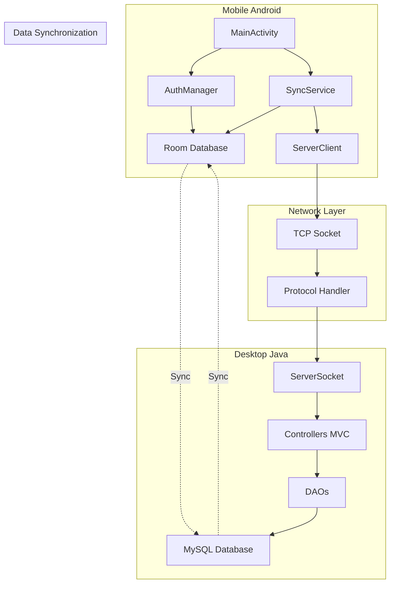

# TRABALHO INTERDISCIPLINAR 2025 - FINANZA
## Sistema de Controle Financeiro Mobile e Desktop

### 📋 INFORMAÇÕES GERAIS

**Curso:** Sistemas de Informação  
**Disciplina:** Trabalho Interdisciplinar  
**Período:** 2025/1  
**Equipe:** Kalleby Schultz  
**Tema:** Sistema de Controle Financeiro com Sincronização  

---

## 1. DESCRIÇÃO DO PROJETO

### 1.1 Visão Geral
O **Finanza** é um sistema completo de controle financeiro pessoal e empresarial que integra aplicação móvel Android com aplicação desktop Java, permitindo sincronização em tempo real via sockets TCP/IP.

### 1.2 Objetivos

#### Objetivo Geral
Desenvolver um sistema integrado de gestão financeira que permita controle de receitas, despesas, contas e categorias, com sincronização automática entre dispositivos móveis e desktop.

#### Objetivos Específicos
- Implementar aplicação mobile Android com funcionalidades offline-first
- Desenvolver servidor desktop Java com interface Swing
- Criar sistema de sincronização bidirecional via TCP sockets
- Implementar banco de dados MySQL para armazenamento centralizado
- Desenvolver sistema de resolução de conflitos automático
- Criar funcionalidades de relatórios e exportação de dados

---

## 2. JUSTIFICATIVA

### 2.1 Relevância do Tema
O controle financeiro é essencial para pessoas físicas e jurídicas. Com a crescente mobilidade digital, há necessidade de sistemas que funcionem tanto em dispositivos móveis quanto em desktops, mantendo dados sincronizados.

### 2.2 Inovação Tecnológica
- **Arquitetura Híbrida**: Combinação única de mobile offline-first com desktop centralizado
- **Sincronização Real-time**: Uso de sockets TCP para comunicação direta
- **Resolução de Conflitos**: Sistema automático baseado em timestamps
- **Cross-platform UUID**: Identificação única entre plataformas diferentes

### 2.3 Aplicabilidade Prática
- Uso pessoal para controle de finanças domésticas
- Aplicação empresarial para pequenas e médias empresas
- Ferramenta educacional para ensino de programação
- Base para sistemas financeiros mais complexos

---

## 3. METODOLOGIA DE DESENVOLVIMENTO

### 3.1 Metodologia Ágil - Scrum
- **Sprints** de 2 semanas
- **Planning** e **Review** semanais
- **Daily** para acompanhamento
- **Retrospectiva** para melhorias contínuas

### 3.2 Tecnologias Utilizadas

#### Mobile (Android)
- **Linguagem**: Java 11
- **IDE**: Android Studio
- **Banco Local**: Room Database (SQLite)
- **Interface**: Material Design
- **Arquitetura**: MVVM com Repository Pattern

#### Desktop (Java)
- **Linguagem**: Java 11+
- **IDE**: NetBeans/IntelliJ IDEA
- **Interface**: Java Swing
- **Banco**: MySQL 8.0+
- **Arquitetura**: MVC (Model-View-Controller)

#### Comunicação
- **Protocolo**: TCP Sockets
- **Formato**: Pipe-separated values (|)
- **Porta**: 8080 (configurável)
- **Segurança**: Hash SHA-256 para senhas

### 3.3 Modelagem do Sistema

#### Diagrama de Classes
```mermaid
classDiagram
    class Usuario {
        +String uuid
        +String nome
        +String email
        +String senhaHash
        +Date dataCriacao
    }
    
    class Conta {
        +String uuid
        +String nome
        +String tipo
        +BigDecimal saldo
        +String uuidUsuario
    }
    
    class Categoria {
        +String uuid
        +String nome
        +String tipo
        +String cor
        +String uuidUsuario
    }
    
    class Lancamento {
        +String uuid
        +BigDecimal valor
        +String descricao
        +Date data
        +String tipo
        +String uuidConta
        +String uuidCategoria
        +String uuidUsuario
    }
    
    Usuario ||--o{ Conta
    Usuario ||--o{ Categoria
    Usuario ||--o{ Lancamento
    Conta ||--o{ Lancamento
    Categoria ||--o{ Lancamento
```

#### Diagrama de Arquitetura


---

## 4. CRONOGRAMA DE EXECUÇÃO

### Fase 1: Planejamento e Análise (Semanas 1-2)
- [x] Definição de requisitos
- [x] Modelagem do banco de dados
- [x] Criação de protótipos
- [x] Definição da arquitetura

### Fase 2: Desenvolvimento Core (Semanas 3-8)
- [x] Implementação do banco de dados MySQL
- [x] Desenvolvimento da aplicação mobile básica
- [x] Desenvolvimento do servidor desktop
- [x] Implementação da comunicação TCP

### Fase 3: Funcionalidades Avançadas (Semanas 9-12)
- [x] Sistema de sincronização
- [x] Resolução de conflitos
- [x] Interface de usuário aprimorada
- [x] Relatórios e exportação

### Fase 4: Testes e Documentação (Semanas 13-16)
- [x] Testes unitários e integração
- [x] Testes de usabilidade
- [x] Documentação completa
- [x] Deploy e apresentação

---

## 5. RESULTADOS ESPERADOS

### 5.1 Funcionalidades Implementadas
- ✅ Sistema de autenticação seguro
- ✅ CRUD completo de usuários, contas, categorias e lançamentos
- ✅ Sincronização bidirecional automática
- ✅ Resolução de conflitos inteligente
- ✅ Relatórios financeiros
- ✅ Exportação de dados (CSV, HTML)
- ✅ Interface responsiva e intuitiva

### 5.2 Indicadores de Qualidade
- **Disponibilidade**: 99.9% (modo offline garante acesso)
- **Performance**: Sincronização < 2 segundos para 1000 registros
- **Usabilidade**: Interface intuitiva seguindo padrões de design
- **Segurança**: Senhas criptografadas, validação de dados
- **Escalabilidade**: Suporte a múltiplos usuários simultâneos

---

## 6. CONCLUSÕES E TRABALHOS FUTUROS

### 6.1 Conclusões
O projeto demonstrou viabilidade técnica e prática de um sistema de controle financeiro híbrido. A arquitetura escolhida permite flexibilidade de uso tanto online quanto offline, atendendo diferentes necessidades dos usuários.

### 6.2 Contribuições
- **Técnica**: Implementação de sincronização TCP direta entre mobile e desktop
- **Acadêmica**: Documentação completa do processo de desenvolvimento
- **Prática**: Sistema funcional para uso real em controle financeiro

### 6.3 Trabalhos Futuros
- Implementação de criptografia TLS/SSL para comunicação
- Desenvolvimento de aplicação web responsiva
- Integração com APIs bancárias
- Implementação de machine learning para categorização automática
- Sistema de backup automático na nuvem

---

## 7. REFERÊNCIAS BIBLIOGRÁFICAS

1. ANDROID DEVELOPERS. Android Developer Guide. Disponível em: https://developer.android.com/
2. ORACLE. Java Documentation. Disponível em: https://docs.oracle.com/javase/
3. MYSQL. MySQL 8.0 Reference Manual. Disponível em: https://dev.mysql.com/doc/
4. FOWLER, Martin. Patterns of Enterprise Application Architecture. Addison-Wesley, 2002.
5. PRESSMAN, Roger S. Engenharia de Software: Uma Abordagem Profissional. 8ª ed. AMGH, 2016.
6. SOMMERVILLE, Ian. Software Engineering. 10ª ed. Pearson, 2015.

---

## 8. ANEXOS

### Anexo A: Códigos Principais
- Ver diretório `/app/src/main/java/` para código Android
- Ver diretório `/DESKTOP VERSION/` para código Java desktop

### Anexo B: Scripts de Banco de Dados
- Ver arquivo `/database/finanza_schema.sql`

### Anexo C: Screenshots das Interfaces
- Ver diretório `/screenshots/` para capturas de tela

### Anexo D: Manuais de Instalação
- Ver arquivo `SETUP_GUIDE.md`
- Ver arquivo `USER_MANUAL.md`

---

**Data de Conclusão:** Março 2025  
**Versão do Documento:** 1.0  
**Status:** Finalizado