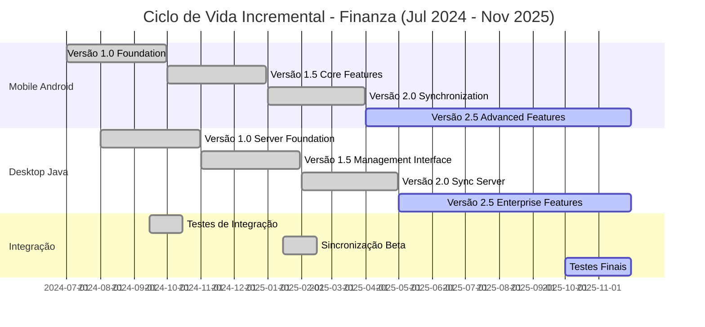

# 4. CICLO DE VIDA DO SOFTWARE - FINANZA

## 📋 Modelo Incremental de Desenvolvimento

O sistema Finanza utiliza o **Modelo Incremental** de desenvolvimento, onde o produto final é construído através de incrementos sucessivos, permitindo entregas funcionais em cada etapa e feedback contínuo dos stakeholders.

### 🎯 Características do Modelo Incremental Adotado

- **Período Total:** Julho 2024 - Novembro 2025 (16 meses)
- **Incrementos:** 4 fases principais com 2+ versões cada plataforma
- **Entregas:** Versões funcionais a cada incremento
- **Integração:** Contínua entre mobile e desktop
- **Feedback:** Incorporado a cada ciclo

---

## 📊 Cronograma de Versões por Plataforma

### 📱 **VERSÕES MOBILE (Android)**

#### **Versão Mobile 1.0 - "Foundation"**
- **Período:** Julho - Setembro 2024
- **Funcionalidades Principais:**
  - Sistema de autenticação (login/registro)
  - CRUD básico de transações
  - Interface inicial com Material Design
  - Armazenamento local (SQLite)
- **Status:** ✅ Concluída

#### **Versão Mobile 1.5 - "Core Features"**
- **Período:** Outubro - Dezembro 2024
- **Funcionalidades Principais:**
  - Gestão completa de contas e categorias
  - Dashboard com gráficos básicos
  - Funcionalidade offline robusta
  - Preparação para sincronização
- **Status:** ✅ Concluída

#### **Versão Mobile 2.0 - "Synchronization"**
- **Período:** Janeiro - Março 2025
- **Funcionalidades Principais:**
  - Sincronização bidirecional com desktop
  - Resolução automática de conflitos
  - Melhorias na interface de usuário
  - Notificações de sincronização
- **Status:** ✅ Concluída

#### **Versão Mobile 2.5 - "Advanced Features"**
- **Período:** Abril - Novembro 2025
- **Funcionalidades Principais:**
  - Relatórios avançados
  - Exportação de dados
  - Configurações de sincronização
  - Otimizações de performance
- **Status:** 🚧 Em desenvolvimento

---

### 🖥️ **VERSÕES DESKTOP (Java)**

#### **Versão Desktop 1.0 - "Server Foundation"**
- **Período:** Agosto - Outubro 2024
- **Funcionalidades Principais:**
  - Servidor TCP para comunicação
  - Interface Swing básica
  - Conexão com MySQL
  - Autenticação de usuários
- **Status:** ✅ Concluída

#### **Versão Desktop 1.5 - "Management Interface"**
- **Período:** Novembro 2024 - Janeiro 2025
- **Funcionalidades Principais:**
  - Interface completa de gerenciamento
  - CRUD de todas as entidades
  - Dashboard desktop
  - Sistema de backup
- **Status:** ✅ Concluída

#### **Versão Desktop 2.0 - "Sync Server"**
- **Período:** Fevereiro - Abril 2025
- **Funcionalidades Principais:**
  - Sincronização multi-cliente
  - Resolução de conflitos servidor-side
  - Monitoramento de conexões
  - Logs de auditoria
- **Status:** ✅ Concluída

#### **Versão Desktop 2.5 - "Enterprise Features"**
- **Período:** Maio - Novembro 2025
- **Funcionalidades Principais:**
  - Relatórios empresariais
  - Exportação avançada (PDF, Excel)
  - Configurações administrativas
  - Performance otimizada
- **Status:** 🚧 Em desenvolvimento

---

## 🔄 Diagrama do Ciclo de Vida Incremental

---

## 📈 Evolução das Funcionalidades por Incremento

### **Incremento 1: Fundação (Jul-Sep 2024)**
| Mobile 1.0 | Desktop 1.0 |
|------------|-------------|
| ✅ Autenticação básica | ✅ Servidor TCP |
| ✅ CRUD transações | ✅ Interface Swing |
| ✅ SQLite local | ✅ MySQL connection |
| ✅ Material Design | ✅ Autenticação |

### **Incremento 2: Expansão (Out-Dez 2024)**
| Mobile 1.5 | Desktop 1.5 |
|------------|-------------|
| ✅ Gestão contas/categorias | ✅ Interface completa |
| ✅ Dashboard com gráficos | ✅ CRUD completo |
| ✅ Modo offline robusto | ✅ Dashboard desktop |
| ✅ Preparação sync | ✅ Sistema backup |

### **Incremento 3: Sincronização (Jan-Abr 2025)**
| Mobile 2.0 | Desktop 2.0 |
|------------|-------------|
| ✅ Sync bidirecional | ✅ Multi-cliente |
| ✅ Resolução conflitos | ✅ Conflitos server-side |
| ✅ UI melhorada | ✅ Monitor conexões |
| ✅ Notificações | ✅ Logs auditoria |

### **Incremento 4: Finalização (Mai-Nov 2025)**
| Mobile 2.5 | Desktop 2.5 |
|------------|-------------|
| 🚧 Relatórios avançados | 🚧 Relatórios empresariais |
| 🚧 Exportação dados | 🚧 Export PDF/Excel |
| 🚧 Config sync | 🚧 Config admin |
| 🚧 Performance | 🚧 Performance otimizada |

---

## 🎯 Benefícios do Modelo Incremental

### **Para o Desenvolvimento:**
- ✅ Entregas funcionais frequentes
- ✅ Feedback contínuo dos usuários
- ✅ Redução de riscos técnicos
- ✅ Identificação precoce de problemas

### **Para os Stakeholders:**
- ✅ Visibilidade do progresso
- ✅ Possibilidade de mudanças de escopo
- ✅ ROI mais rápido
- ✅ Maior satisfação do cliente

### **Para a Qualidade:**
- ✅ Testes incrementais
- ✅ Integração contínua
- ✅ Documentação atualizada
- ✅ Código mais estável

---

## 📋 Critérios de Conclusão por Incremento

### **Critérios Técnicos:**
- [ ] Todos os testes unitários passando (>90% cobertura)
- [ ] Testes de integração aprovados
- [ ] Performance dentro dos parâmetros definidos
- [ ] Documentação técnica atualizada

### **Critérios de Negócio:**
- [ ] Funcionalidades conforme especificação
- [ ] Validação com stakeholders
- [ ] Critérios de aceitação atendidos
- [ ] Documentação do usuário disponível

### **Critérios de Qualidade:**
- [ ] Code review aprovado
- [ ] Análise de segurança concluída
- [ ] Testes de usabilidade realizados
- [ ] Deploy em ambiente de produção

---

**Legenda do Diagrama:**
- **Verde (✅)**: Incrementos concluídos e entregues
- **Azul (🚧)**: Incremento em desenvolvimento ativo
- **Cinza**: Incrementos planejados para o futuro

**Observações:**
- O modelo incremental permite ajustes de escopo a cada incremento
- Cada versão é funcional e pode ser utilizada independentemente
- A sincronização entre plataformas é o principal marco técnico do projeto
- O cronograma permite buffer de tempo para resolução de problemas complexos

---

*Documento atualizado em: Dezembro 2024*  
*Versão: 2.0*  
*Próxima revisão: Janeiro 2025*