# 8. DIAGRAMA ER (ENTIDADE-RELACIONAMENTO) - FINANZA

## 📋 Visão Geral

O diagrama Entidade-Relacionamento (ER) do sistema Finanza apresenta a estrutura completa do banco de dados MySQL, incluindo todas as entidades, atributos, relacionamentos e restrições de integridade necessárias para suportar as aplicações mobile e desktop.

---

## 🗄️ Modelo Entidade-Relacionamento

```mermaid
erDiagram
    %% Entidade Usuario
    USUARIO {
        string uuid PK "UUID único do usuário"
        string nome "Nome completo"
        string email UK "Email único para login"
        string senha_hash "Senha criptografada SHA-256"
        datetime data_criacao "Data de criação da conta"
        datetime ultimo_login "Último acesso ao sistema"
        boolean ativo "Status da conta (ativo/inativo)"
        text configuracoes "Configurações JSON do usuário"
        datetime data_modificacao "Última modificação dos dados"
        int versao "Controle de versão para sync"
    }
    
    %% Entidade Conta
    CONTA {
        string uuid PK "UUID único da conta"
        string nome "Nome da conta (ex: Conta Corrente)"
        string tipo "Tipo da conta (CORRENTE, POUPANCA, CARTAO, DINHEIRO)"
        decimal saldo "Saldo atual da conta"
        string banco "Nome do banco/instituição"
        string agencia "Número da agência"
        string numero "Número da conta"
        boolean ativa "Status da conta (ativa/inativa)"
        datetime data_criacao "Data de criação da conta"
        datetime data_modificacao "Última modificação"
        int versao "Controle de versão para sync"
        string uuid_usuario FK "Referência ao usuário proprietário"
    }
    
    %% Entidade Categoria
    CATEGORIA {
        string uuid PK "UUID único da categoria"
        string nome "Nome da categoria (ex: Alimentação)"
        string tipo "Tipo (RECEITA, DESPESA)"
        string cor "Código hexadecimal da cor"
        string icone "Nome do ícone para UI"
        boolean ativa "Status da categoria (ativa/inativa)"
        datetime data_criacao "Data de criação da categoria"
        datetime data_modificacao "Última modificação"
        int versao "Controle de versão para sync"
        string uuid_usuario FK "Referência ao usuário proprietário"
    }
    
    %% Entidade Transacao
    TRANSACAO {
        string uuid PK "UUID único da transação"
        decimal valor "Valor da transação (positivo/negativo)"
        string descricao "Descrição da transação"
        date data "Data da transação"
        string tipo "Tipo (RECEITA, DESPESA, TRANSFERENCIA)"
        string status "Status (CONFIRMADA, PENDENTE, CANCELADA)"
        text observacoes "Observações adicionais"
        datetime data_criacao "Data de criação do registro"
        datetime data_modificacao "Última modificação"
        int versao "Controle de versão para sync"
        string uuid_conta FK "Referência à conta origem"
        string uuid_categoria FK "Referência à categoria"
        string uuid_usuario FK "Referência ao usuário"
        string uuid_conta_destino FK "Para transferências (opcional)"
    }
    
    %% Entidade SyncData
    SYNC_DATA {
        string uuid PK "UUID único do registro de sync"
        string tipo_entidade "Tipo da entidade (USUARIO, CONTA, CATEGORIA, TRANSACAO)"
        string uuid_entidade "UUID da entidade modificada"
        string acao "Ação realizada (CREATE, UPDATE, DELETE)"
        datetime timestamp "Momento da modificação"
        text dados_json "Dados completos da entidade em JSON"
        boolean sincronizado "Status de sincronização"
        datetime data_sincronizacao "Quando foi sincronizado"
        string uuid_usuario FK "Referência ao usuário"
    }
    
    %% Entidade ConflictResolution
    CONFLICT_RESOLUTION {
        string uuid PK "UUID único do conflito"
        string tipo_conflito "Tipo (UPDATE_CONFLICT, DELETE_CONFLICT, CREATE_CONFLICT)"
        string uuid_entidade "UUID da entidade em conflito"
        text dados_servidor "Dados da versão do servidor"
        text dados_cliente "Dados da versão do cliente"
        string resolucao "Estratégia de resolução aplicada"
        datetime timestamp_conflito "Quando o conflito foi detectado"
        datetime timestamp_resolucao "Quando foi resolvido"
        boolean resolvido "Status de resolução"
        string uuid_usuario FK "Referência ao usuário"
    }
    
    %% Entidade Relatorio
    RELATORIO {
        string uuid PK "UUID único do relatório"
        string tipo "Tipo (MENSAL, ANUAL, PERSONALIZADO, CATEGORIA)"
        string titulo "Título do relatório"
        date data_inicio "Data inicial do período"
        date data_fim "Data final do período"
        text parametros "Parâmetros de filtro em JSON"
        string formato "Formato de saída (PDF, CSV, EXCEL, HTML)"
        datetime data_geracao "Quando foi gerado"
        string caminho_arquivo "Caminho do arquivo gerado"
        boolean ativo "Status do relatório"
        string uuid_usuario FK "Referência ao usuário"
    }
    
    %% Entidade Session
    SESSION {
        string uuid PK "UUID único da sessão"
        string token "Token de autenticação"
        datetime data_criacao "Início da sessão"
        datetime data_expiracao "Expiração da sessão"
        string ip_address "IP do cliente"
        string user_agent "Navegador/app utilizado"
        boolean ativa "Status da sessão"
        datetime ultimo_acesso "Último acesso da sessão"
        string uuid_usuario FK "Referência ao usuário"
    }
    
    %% Entidade AuditLog
    AUDIT_LOG {
        string uuid PK "UUID único do log"
        string acao "Ação realizada"
        string entidade "Entidade afetada"
        string uuid_entidade "UUID da entidade"
        text dados_anteriores "Estado antes da modificação"
        text dados_novos "Estado depois da modificação"
        datetime timestamp "Momento da ação"
        string ip_address "IP do cliente"
        string user_agent "Navegador/app utilizado"
        string uuid_usuario FK "Usuário que realizou a ação"
    }
    
    %% Entidade Backup
    BACKUP {
        string uuid PK "UUID único do backup"
        string tipo "Tipo (AUTOMATICO, MANUAL, INCREMENTAL)"
        datetime data_criacao "Data da criação do backup"
        string caminho_arquivo "Local do arquivo de backup"
        long tamanho_bytes "Tamanho do arquivo em bytes"
        string checksum "Hash MD5 para verificação"
        boolean comprimido "Se está comprimido"
        string status "Status (EM_ANDAMENTO, CONCLUIDO, ERRO)"
        text observacoes "Observações sobre o backup"
    }
    
    %% Relacionamentos
    USUARIO ||--o{ CONTA : "possui"
    USUARIO ||--o{ CATEGORIA : "cria"
    USUARIO ||--o{ TRANSACAO : "realiza"
    USUARIO ||--o{ SYNC_DATA : "gera"
    USUARIO ||--o{ CONFLICT_RESOLUTION : "possui"
    USUARIO ||--o{ RELATORIO : "solicita"
    USUARIO ||--o{ SESSION : "inicia"
    USUARIO ||--o{ AUDIT_LOG : "executa"
    
    CONTA ||--o{ TRANSACAO : "contém"
    CATEGORIA ||--o{ TRANSACAO : "classifica"
    
    TRANSACAO ||--o{ SYNC_DATA : "gera dados sync"
    CONTA ||--o{ SYNC_DATA : "gera dados sync"
    CATEGORIA ||--o{ SYNC_DATA : "gera dados sync"
    USUARIO ||--o{ SYNC_DATA : "gera dados sync"
    
    CONTA ||--o{ TRANSACAO : "destino (transferência)"
```



---

## 📊 Especificação Detalhada das Entidades

### **👤 Entidade USUARIO**
**Finalidade:** Armazenar dados de usuários do sistema

| Atributo | Tipo | Restrições | Descrição |
|----------|------|------------|-----------|
| uuid | VARCHAR(36) | PK, NOT NULL | Chave primária UUID |
| nome | VARCHAR(100) | NOT NULL | Nome completo do usuário |
| email | VARCHAR(100) | UK, NOT NULL | Email único para login |
| senha_hash | VARCHAR(255) | NOT NULL | Senha criptografada SHA-256 |
| data_criacao | DATETIME | NOT NULL, DEFAULT NOW() | Timestamp de criação |
| ultimo_login | DATETIME | NULL | Último acesso registrado |
| ativo | BOOLEAN | NOT NULL, DEFAULT TRUE | Status da conta |
| configuracoes | TEXT | NULL | JSON com preferências |
| data_modificacao | DATETIME | NOT NULL, DEFAULT NOW() | Última alteração |
| versao | INT | NOT NULL, DEFAULT 1 | Controle de versão |

**Índices:**
- PRIMARY KEY (uuid)
- UNIQUE KEY uk_usuario_email (email)
- INDEX idx_usuario_ativo (ativo)

---

### **🏦 Entidade CONTA**
**Finalidade:** Representar contas bancárias e carteiras

| Atributo | Tipo | Restrições | Descrição |
|----------|------|------------|-----------|
| uuid | VARCHAR(36) | PK, NOT NULL | Chave primária UUID |
| nome | VARCHAR(100) | NOT NULL | Nome da conta |
| tipo | ENUM | NOT NULL | CORRENTE, POUPANCA, CARTAO, DINHEIRO |
| saldo | DECIMAL(15,2) | NOT NULL, DEFAULT 0.00 | Saldo atual |
| banco | VARCHAR(100) | NULL | Nome do banco |
| agencia | VARCHAR(20) | NULL | Número da agência |
| numero | VARCHAR(30) | NULL | Número da conta |
| ativa | BOOLEAN | NOT NULL, DEFAULT TRUE | Status da conta |
| data_criacao | DATETIME | NOT NULL, DEFAULT NOW() | Timestamp de criação |
| data_modificacao | DATETIME | NOT NULL, DEFAULT NOW() | Última alteração |
| versao | INT | NOT NULL, DEFAULT 1 | Controle de versão |
| uuid_usuario | VARCHAR(36) | FK, NOT NULL | Referência ao usuário |

**Índices:**
- PRIMARY KEY (uuid)
- FOREIGN KEY fk_conta_usuario (uuid_usuario) REFERENCES USUARIO(uuid)
- INDEX idx_conta_usuario (uuid_usuario)
- INDEX idx_conta_tipo (tipo)

---

### **🏷️ Entidade CATEGORIA**
**Finalidade:** Organizar transações por categorias

| Atributo | Tipo | Restrições | Descrição |
|----------|------|------------|-----------|
| uuid | VARCHAR(36) | PK, NOT NULL | Chave primária UUID |
| nome | VARCHAR(100) | NOT NULL | Nome da categoria |
| tipo | ENUM | NOT NULL | RECEITA, DESPESA |
| cor | VARCHAR(7) | NOT NULL | Código hexadecimal |
| icone | VARCHAR(50) | NOT NULL | Nome do ícone |
| ativa | BOOLEAN | NOT NULL, DEFAULT TRUE | Status da categoria |
| data_criacao | DATETIME | NOT NULL, DEFAULT NOW() | Timestamp de criação |
| data_modificacao | DATETIME | NOT NULL, DEFAULT NOW() | Última alteração |
| versao | INT | NOT NULL, DEFAULT 1 | Controle de versão |
| uuid_usuario | VARCHAR(36) | FK, NOT NULL | Referência ao usuário |

**Índices:**
- PRIMARY KEY (uuid)
- FOREIGN KEY fk_categoria_usuario (uuid_usuario) REFERENCES USUARIO(uuid)
- INDEX idx_categoria_usuario (uuid_usuario)
- INDEX idx_categoria_tipo (tipo)

---

### **💰 Entidade TRANSACAO**
**Finalidade:** Registrar movimentações financeiras

| Atributo | Tipo | Restrições | Descrição |
|----------|------|------------|-----------|
| uuid | VARCHAR(36) | PK, NOT NULL | Chave primária UUID |
| valor | DECIMAL(15,2) | NOT NULL | Valor da transação |
| descricao | VARCHAR(255) | NOT NULL | Descrição da transação |
| data | DATE | NOT NULL | Data da transação |
| tipo | ENUM | NOT NULL | RECEITA, DESPESA, TRANSFERENCIA |
| status | ENUM | NOT NULL, DEFAULT 'CONFIRMADA' | CONFIRMADA, PENDENTE, CANCELADA |
| observacoes | TEXT | NULL | Observações adicionais |
| data_criacao | DATETIME | NOT NULL, DEFAULT NOW() | Timestamp de criação |
| data_modificacao | DATETIME | NOT NULL, DEFAULT NOW() | Última alteração |
| versao | INT | NOT NULL, DEFAULT 1 | Controle de versão |
| uuid_conta | VARCHAR(36) | FK, NOT NULL | Conta origem |
| uuid_categoria | VARCHAR(36) | FK, NOT NULL | Categoria da transação |
| uuid_usuario | VARCHAR(36) | FK, NOT NULL | Usuário proprietário |
| uuid_conta_destino | VARCHAR(36) | FK, NULL | Conta destino (transferências) |

**Índices:**
- PRIMARY KEY (uuid)
- FOREIGN KEY fk_transacao_conta (uuid_conta) REFERENCES CONTA(uuid)
- FOREIGN KEY fk_transacao_categoria (uuid_categoria) REFERENCES CATEGORIA(uuid)
- FOREIGN KEY fk_transacao_usuario (uuid_usuario) REFERENCES USUARIO(uuid)
- FOREIGN KEY fk_transacao_conta_destino (uuid_conta_destino) REFERENCES CONTA(uuid)
- INDEX idx_transacao_data (data)
- INDEX idx_transacao_usuario (uuid_usuario)
- INDEX idx_transacao_tipo (tipo)

---

### **🔄 Entidade SYNC_DATA**
**Finalidade:** Controlar sincronização entre mobile e desktop

| Atributo | Tipo | Restrições | Descrição |
|----------|------|------------|-----------|
| uuid | VARCHAR(36) | PK, NOT NULL | Chave primária UUID |
| tipo_entidade | ENUM | NOT NULL | USUARIO, CONTA, CATEGORIA, TRANSACAO |
| uuid_entidade | VARCHAR(36) | NOT NULL | UUID da entidade modificada |
| acao | ENUM | NOT NULL | CREATE, UPDATE, DELETE |
| timestamp | DATETIME | NOT NULL, DEFAULT NOW() | Momento da modificação |
| dados_json | TEXT | NOT NULL | Dados da entidade em JSON |
| sincronizado | BOOLEAN | NOT NULL, DEFAULT FALSE | Status de sincronização |
| data_sincronizacao | DATETIME | NULL | Quando foi sincronizado |
| uuid_usuario | VARCHAR(36) | FK, NOT NULL | Usuário proprietário |

**Índices:**
- PRIMARY KEY (uuid)
- FOREIGN KEY fk_sync_usuario (uuid_usuario) REFERENCES USUARIO(uuid)
- INDEX idx_sync_usuario (uuid_usuario)
- INDEX idx_sync_sincronizado (sincronizado)
- INDEX idx_sync_timestamp (timestamp)

---

## 🔗 Relacionamentos e Cardinalidades

### **Relacionamentos Principais:**

#### **USUARIO → CONTA (1:N)**
- Um usuário pode ter múltiplas contas
- Uma conta pertence a apenas um usuário
- Exclusão do usuário remove todas as contas

#### **USUARIO → CATEGORIA (1:N)**
- Um usuário pode criar múltiplas categorias
- Uma categoria pertence a apenas um usuário
- Exclusão do usuário remove todas as categorias

#### **USUARIO → TRANSACAO (1:N)**
- Um usuário pode realizar múltiplas transações
- Uma transação pertence a apenas um usuário
- Exclusão do usuário remove todas as transações

#### **CONTA → TRANSACAO (1:N)**
- Uma conta pode ter múltiplas transações
- Uma transação está associada a uma conta origem
- Exclusão da conta não remove transações (soft delete)

#### **CATEGORIA → TRANSACAO (1:N)**
- Uma categoria pode classificar múltiplas transações
- Uma transação tem apenas uma categoria
- Exclusão da categoria não remove transações

#### **TRANSACAO → TRANSACAO (Self-Reference)**
- Para transferências entre contas
- uuid_conta_destino referencia outra conta do mesmo usuário

---

## 🔒 Restrições de Integridade

### **Chaves Primárias:**
- Todas as entidades usam UUID como chave primária
- UUIDs garantem unicidade global (importante para sync)

### **Chaves Estrangeiras:**
- ON DELETE RESTRICT para preservar histórico
- ON UPDATE CASCADE para propagação de mudanças

### **Restrições de Domínio:**
```sql
-- Valores positivos para saldos e valores
ALTER TABLE CONTA ADD CONSTRAINT chk_conta_saldo CHECK (saldo >= 0);
ALTER TABLE TRANSACAO ADD CONSTRAINT chk_transacao_valor CHECK (valor != 0);

-- Datas válidas
ALTER TABLE TRANSACAO ADD CONSTRAINT chk_transacao_data 
    CHECK (data <= CURDATE());

-- Email válido
ALTER TABLE USUARIO ADD CONSTRAINT chk_usuario_email 
    CHECK (email REGEXP '^[A-Za-z0-9._%+-]+@[A-Za-z0-9.-]+\.[A-Za-z]{2,}$');

-- Cores válidas (hex)
ALTER TABLE CATEGORIA ADD CONSTRAINT chk_categoria_cor 
    CHECK (cor REGEXP '^#[0-9A-Fa-f]{6}$');
```

### **Restrições de Negócio:**
```sql
-- Transferências devem ter conta destino
ALTER TABLE TRANSACAO ADD CONSTRAINT chk_transferencia 
    CHECK (tipo != 'TRANSFERENCIA' OR uuid_conta_destino IS NOT NULL);

-- Conta destino deve ser diferente da origem
ALTER TABLE TRANSACAO ADD CONSTRAINT chk_contas_diferentes 
    CHECK (uuid_conta != uuid_conta_destino);

-- Versão sempre incrementa
ALTER TABLE USUARIO ADD CONSTRAINT chk_usuario_versao CHECK (versao > 0);
ALTER TABLE CONTA ADD CONSTRAINT chk_conta_versao CHECK (versao > 0);
ALTER TABLE CATEGORIA ADD CONSTRAINT chk_categoria_versao CHECK (versao > 0);
ALTER TABLE TRANSACAO ADD CONSTRAINT chk_transacao_versao CHECK (versao > 0);
```

---

## 📈 Otimizações e Performance

### **Índices Estratégicos:**
```sql
-- Consultas por usuário (mais frequentes)
CREATE INDEX idx_transacao_usuario_data ON TRANSACAO(uuid_usuario, data DESC);
CREATE INDEX idx_conta_usuario_ativa ON CONTA(uuid_usuario, ativa);

-- Sincronização
CREATE INDEX idx_sync_usuario_timestamp ON SYNC_DATA(uuid_usuario, timestamp DESC);
CREATE INDEX idx_sync_nao_sincronizado ON SYNC_DATA(sincronizado, timestamp);

-- Relatórios
CREATE INDEX idx_transacao_periodo ON TRANSACAO(data, tipo, uuid_usuario);
CREATE INDEX idx_transacao_categoria_data ON TRANSACAO(uuid_categoria, data);
```

### **Particionamento:**
```sql
-- Particionar TRANSACAO por ano para melhor performance
ALTER TABLE TRANSACAO PARTITION BY RANGE (YEAR(data)) (
    PARTITION p2023 VALUES LESS THAN (2024),
    PARTITION p2024 VALUES LESS THAN (2025),
    PARTITION p2025 VALUES LESS THAN (2026),
    PARTITION p_future VALUES LESS THAN MAXVALUE
);
```

---

## 🔧 Triggers e Procedures

### **Triggers de Auditoria:**
```sql
-- Trigger para atualizar data_modificacao
DELIMITER //
CREATE TRIGGER tr_usuario_update 
    BEFORE UPDATE ON USUARIO 
    FOR EACH ROW 
BEGIN 
    SET NEW.data_modificacao = NOW();
    SET NEW.versao = OLD.versao + 1;
END//

CREATE TRIGGER tr_conta_update 
    BEFORE UPDATE ON CONTA 
    FOR EACH ROW 
BEGIN 
    SET NEW.data_modificacao = NOW();
    SET NEW.versao = OLD.versao + 1;
END//
DELIMITER ;
```

### **Triggers de Sincronização:**
```sql
-- Trigger para criar dados de sync automaticamente
DELIMITER //
CREATE TRIGGER tr_transacao_sync_insert 
    AFTER INSERT ON TRANSACAO 
    FOR EACH ROW 
BEGIN 
    INSERT INTO SYNC_DATA (uuid, tipo_entidade, uuid_entidade, acao, dados_json, uuid_usuario)
    VALUES (UUID(), 'TRANSACAO', NEW.uuid, 'CREATE', 
            JSON_OBJECT('transacao', NEW.*), NEW.uuid_usuario);
END//
DELIMITER ;
```

---

## 📊 Estatísticas do Modelo

### **Métricas do Banco:**
- **Entidades Principais:** 10 tabelas
- **Relacionamentos:** 15 foreign keys
- **Índices:** 25+ índices otimizados
- **Triggers:** 8 triggers de controle
- **Procedures:** 5 procedures de manutenção

### **Estimativas de Volume:**
- **Usuários:** 1.000-10.000 registros
- **Contas:** 5.000-50.000 registros  
- **Categorias:** 10.000-100.000 registros
- **Transações:** 100.000-1.000.000 registros/ano
- **Sync Data:** 500.000-5.000.000 registros/ano

---

## 🎯 Benefícios da Modelagem

### **Normalização:**
- ✅ 3ª Forma Normal aplicada
- ✅ Eliminação de redundâncias
- ✅ Integridade referencial garantida

### **Flexibilidade:**
- ✅ UUIDs permitem distribuição
- ✅ JSON para dados variáveis
- ✅ Extensibilidade planejada

### **Performance:**
- ✅ Índices otimizados
- ✅ Particionamento estratégico
- ✅ Consultas eficientes

### **Sincronização:**
- ✅ Controle de versão integrado
- ✅ Rastreamento de mudanças
- ✅ Resolução de conflitos

---

**Legenda do Diagrama ER:**
- **Retângulos:** Entidades do sistema
- **Elipses:** Atributos das entidades
- **Losangos:** Relacionamentos
- **Linhas:** Associações entre elementos
- **PK:** Primary Key (Chave Primária)
- **FK:** Foreign Key (Chave Estrangeira)
- **UK:** Unique Key (Chave Única)

**Observações:**
- Modelo segue padrões de normalização de banco de dados
- Suporte completo a sincronização distribuída
- Otimizado para consultas frequentes do sistema
- Integridade referencial totalmente implementada

---

*Diagrama criado seguindo padrões de modelagem de dados*  
*Versão: 1.0 | Data: Dezembro 2024*  
*SGBD: MySQL 8.0+ | Engine: InnoDB*