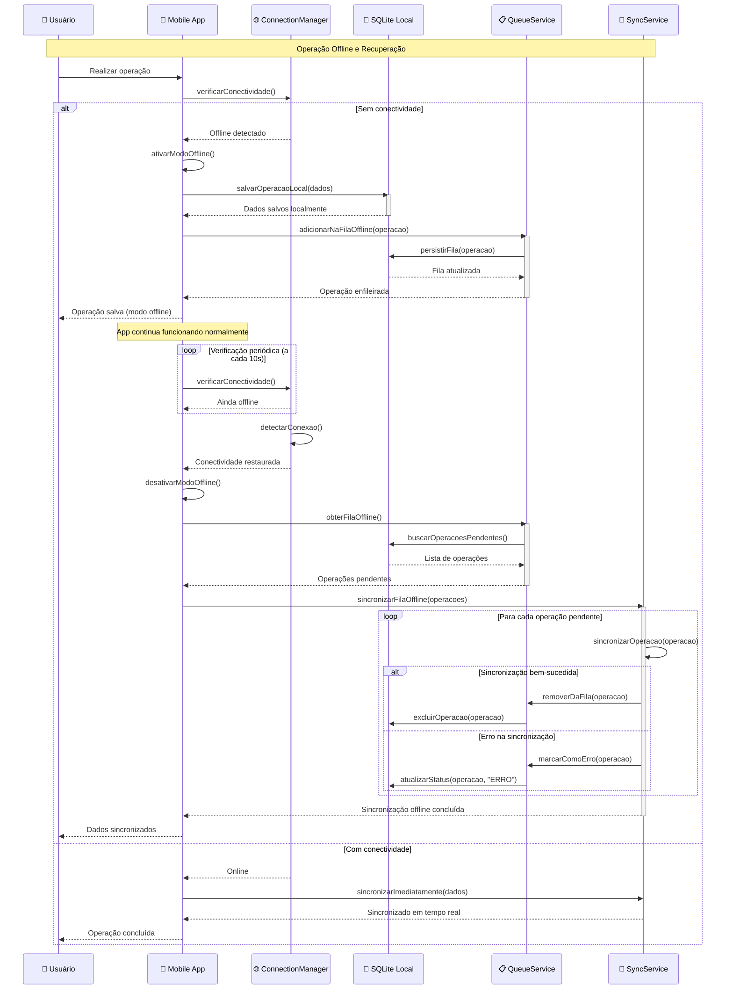

# 9. DIAGRAMA DE SEQUÊNCIA - FINANZA

## 📋 Visão Geral

O diagrama de sequência do sistema Finanza apresenta os principais fluxos de interação entre os componentes do sistema, demonstrando como as operações críticas são executadas desde a interface do usuário até a persistência dos dados, incluindo os processos de sincronização entre mobile e desktop.

---

## 🎯 Cenários de Sequência Principais

### **Cenário 1: Autenticação de Usuário**

```mermaid
sequenceDiagram
    participant U as 👤 Usuário
    participant MA as 📱 Mobile App
    participant AS as 🔐 AuthService
    participant UD as 🗄️ UsuarioDAO
    parameter DB as 🗃️ MySQL
    participant SS as 🔄 SyncService
    
    Note over U, SS: Fluxo de Autenticação
    
    U->>MA: Informa email/senha
    activate MA
    
    MA->>AS: login(email, senha)
    activate AS
    
    AS->>UD: buscarPorEmail(email)
    activate UD
    
    UD->>DB: SELECT * FROM USUARIO WHERE email = ?
    activate DB
    DB-->>UD: Retorna dados do usuário
    deactivate DB
    
    UD-->>AS: Usuario encontrado
    deactivate UD
    
    AS->>AS: validarSenha(senha, senhaHash)
    
    alt Senha válida
        AS->>AS: gerarToken(usuario)
        AS->>AS: criarSessao(usuario)
        AS-->>MA: Login sucesso + token
        
        MA->>SS: iniciarSincronizacaoAutomatica()
        activate SS
        SS-->>MA: Sincronização iniciada
        deactivate SS
        
        MA-->>U: Redireciona para Dashboard
    else Senha inválida
        AS-->>MA: Erro de autenticação
        MA-->>U: Exibe mensagem de erro
    end
    
    deactivate AS
    deactivate MA
```

**Legenda:** Fluxo completo de autenticação mostrando validação de credenciais, geração de token de sessão e inicialização da sincronização automática após login bem-sucedido.

---

### **Cenário 2: Adicionar Nova Transação (Mobile)**

```mermaid
sequenceDiagram
    participant U as 👤 Usuário
    participant MA as 📱 Mobile App
    participant TD as 💰 TransacaoDAO
    parameter LDB as 📱 SQLite Local
    participant SS as 🔄 SyncService
    participant SD as 📡 SyncData
    
    Note over U, SD: Criação de Transação no Mobile
    
    U->>MA: Preenche formulário transação
    U->>MA: Clica "Salvar"
    activate MA
    
    MA->>MA: validarDados(transacao)
    
    alt Dados válidos
        MA->>TD: inserir(transacao)
        activate TD
        
        TD->>LDB: INSERT INTO transacao VALUES (...)
        activate LDB
        LDB-->>TD: Sucesso na inserção
        deactivate LDB
        
        TD-->>MA: Transação salva localmente
        deactivate TD
        
        MA->>SS: adicionarParaSincronizacao(transacao, "CREATE")
        activate SS
        
        SS->>SD: criarSyncData(TRANSACAO, uuid, CREATE)
        activate SD
        SD-->>SS: SyncData criado
        deactivate SD
        
        SS->>SS: adicionarNaFila(syncData)
        SS-->>MA: Adicionado para sincronização
        deactivate SS
        
        alt Conectividade disponível
            MA->>SS: sincronizarAgora()
            activate SS
            Note over SS: Processo de sincronização imediata
            SS-->>MA: Sincronização iniciada
            deactivate SS
        end
        
        MA-->>U: Transação salva com sucesso
    else Dados inválidos
        MA-->>U: Exibe erros de validação
    end
    
    deactivate MA
```

**Legenda:** Processo de criação de transação no mobile, incluindo validação, persistência local, preparação para sincronização e sincronização imediata quando há conectividade.

---

### **Cenário 3: Sincronização Bidirecional**

```mermaid
sequenceDiagram
    participant MA as 📱 Mobile App
    participant SS as 🔄 SyncService
    participant TCP as 🌐 TCP Socket
    parameter DS as 🖥️ Desktop Server
    participant ServerDAO as 🗄️ Server DAO
    parameter MySQL as 🗃️ MySQL
    participant CR as ⚖️ ConflictResolver
    
    Note over MA, CR: Sincronização Automática Bidirecional
    
    loop A cada 30 segundos
        SS->>SS: verificarFilaSincronizacao()
        
        alt Há dados para sincronizar
            SS->>TCP: conectar(servidor)
            activate TCP
            
            TCP->>DS: estabelecerConexao()
            activate DS
            DS-->>TCP: Conexão estabelecida
            
            SS->>TCP: enviarDados(syncDataList)
            TCP->>DS: processarSincronizacao(dados)
            
            DS->>ServerDAO: processarMudancas(dados)
            activate ServerDAO
            
            loop Para cada SyncData
                ServerDAO->>MySQL: verificarConflito(entidade)
                activate MySQL
                
                alt Sem conflito
                    MySQL-->>ServerDAO: OK para atualizar
                    ServerDAO->>MySQL: aplicarMudanca(entidade)
                    MySQL-->>ServerDAO: Sucesso
                else Conflito detectado
                    MySQL-->>ServerDAO: Conflito encontrado
                    ServerDAO->>CR: criarConflito(dadosServidor, dadosCliente)
                    activate CR
                    CR->>CR: analisarTimestamps()
                    CR->>CR: aplicarEstrategiaResolucao()
                    CR-->>ServerDAO: Conflito resolvido
                    deactivate CR
                    ServerDAO->>MySQL: aplicarResolucao()
                end
                
                deactivate MySQL
            end
            
            ServerDAO-->>DS: Processamento concluído
            deactivate ServerDAO
            
            DS->>DS: coletarMudancasDoServidor()
            DS-->>TCP: retornarDadosAtualizados(mudancas)
            TCP-->>SS: receberDados(mudancas)
            
            deactivate DS
            deactivate TCP
            
            SS->>MA: aplicarMudancasLocais(mudancas)
            activate MA
            
            loop Para cada mudança recebida
                MA->>MA: aplicarMudancaLocal(entidade)
            end
            
            MA-->>SS: Mudanças aplicadas
            deactivate MA
            
            SS->>SS: marcarComoSincronizado()
            SS->>MA: notificarSincronizacaoCompleta()
            
        end
    end
```

**Legenda:** Processo completo de sincronização bidirecional automática, incluindo detecção de conflitos, estratégias de resolução e aplicação de mudanças em ambos os lados.

---

### **Cenário 4: Geração de Relatório (Desktop)**

```mermaid
sequenceDiagram
    participant U as 👤 Admin Desktop
    participant DT as 🖥️ Desktop UI
    participant RS as 📊 RelatorioService
    participant TD as 💰 TransacaoDAO
    parameter MySQL as 🗃️ MySQL
    participant EX as 📄 ExportService
    participant FS as 📁 FileSystem
    
    Note over U, FS: Geração de Relatório Financeiro
    
    U->>DT: Acessa tela de relatórios
    DT->>DT: carregarParametros()
    DT-->>U: Exibe formulário de relatório
    
    U->>DT: Define período e filtros
    U->>DT: Clica "Gerar Relatório"
    activate DT
    
    DT->>RS: gerarRelatorio(parametros)
    activate RS
    
    RS->>RS: validarParametros(parametros)
    RS->>TD: buscarTransacoesPorPeriodo(dataInicio, dataFim, filtros)
    activate TD
    
    TD->>MySQL: SELECT com JOINs e filtros complexos
    activate MySQL
    
    Note over MySQL: Query otimizada com índices
    MySQL-->>TD: ResultSet com transações
    deactivate MySQL
    
    TD->>TD: converterParaObjetos(resultSet)
    TD-->>RS: Lista de transações
    deactivate TD
    
    RS->>RS: calcularEstatisticas(transacoes)
    RS->>RS: agruparPorCategoria(transacoes)
    RS->>RS: calcularTotais(transacoes)
    
    alt Formato PDF
        RS->>EX: exportarPDF(dados, template)
        activate EX
        EX->>EX: gerarPDF(dados)
        EX->>FS: salvarArquivo(pdf, caminho)
        FS-->>EX: Arquivo salvo
        EX-->>RS: Caminho do arquivo
        deactivate EX
    else Formato Excel
        RS->>EX: exportarExcel(dados)
        activate EX
        EX->>EX: criarPlanilha(dados)
        EX->>FS: salvarArquivo(excel, caminho)
        FS-->>EX: Arquivo salvo
        EX-->>RS: Caminho do arquivo
        deactivate EX
    else Formato CSV
        RS->>EX: exportarCSV(dados)
        activate EX
        EX->>EX: formatarCSV(dados)
        EX->>FS: salvarArquivo(csv, caminho)
        FS-->>EX: Arquivo salvo
        EX-->>RS: Caminho do arquivo
        deactivate EX
    end
    
    RS->>RS: criarRegistroRelatorio(parametros, caminho)
    RS-->>DT: Relatório gerado com sucesso
    deactivate RS
    
    DT-->>U: Exibe link para download
    
    U->>DT: Clica para baixar
    DT->>FS: abrirArquivo(caminho)
    FS-->>U: Download do relatório
    
    deactivate DT
```

**Legenda:** Processo completo de geração de relatório no desktop, desde a definição de parâmetros até a exportação em diferentes formatos e disponibilização para download.

---

### **Cenário 5: Resolução de Conflito de Sincronização**

```mermaid
sequenceDiagram
    participant MA as 📱 Mobile
    participant SS as 🔄 SyncService
    participant DS as 🖥️ Desktop Server
    participant CR as ⚖️ ConflictResolver
    parameter MySQL as 🗃️ MySQL
    participant AU as 📋 AuditLog
    
    Note over MA, AU: Detecção e Resolução de Conflito
    
    SS->>DS: sincronizarTransacao(transacaoMobile)
    activate DS
    
    DS->>MySQL: verificarVersao(uuid_transacao)
    activate MySQL
    MySQL-->>DS: versao_servidor = 3, versao_mobile = 2
    deactivate MySQL
    
    alt Conflito detectado
        DS->>CR: criarConflito(dadosServidor, dadosMobile)
        activate CR
        
        CR->>CR: analisarTipoConflito()
        
        Note over CR: Tipos: UPDATE_CONFLICT, DELETE_CONFLICT
        
        alt Update Conflict
            CR->>CR: compararTimestamps()
            
            alt Timestamp servidor > mobile
                CR->>CR: estrategia = "USAR_SERVIDOR"
                CR->>MySQL: manterVersaoServidor()
                activate MySQL
                MySQL-->>CR: Versão mantida
                deactivate MySQL
            else Timestamp mobile > servidor
                CR->>CR: estrategia = "USAR_CLIENTE"
                CR->>MySQL: aplicarVersaoMobile()
                activate MySQL
                MySQL-->>CR: Versão atualizada
                deactivate MySQL
            else Timestamps iguais
                CR->>CR: estrategia = "MESCLAR_DADOS"
                CR->>CR: mesclarCampos(servidor, mobile)
                CR->>MySQL: salvarVersaoMesclada()
                activate MySQL
                MySQL-->>CR: Versão mesclada salva
                deactivate MySQL
            end
        
        else Delete Conflict
            CR->>CR: estrategia = "RESTAURAR_REGISTRO"
            CR->>MySQL: restaurarRegistro(dadosMobile)
            activate MySQL
            MySQL-->>CR: Registro restaurado
            deactivate MySQL
        end
        
        CR->>AU: registrarResolucaoConflito(conflito, estrategia)
        activate AU
        AU->>MySQL: INSERT INTO audit_log
        MySQL-->>AU: Log registrado
        AU-->>CR: Auditoria completa
        deactivate AU
        
        CR-->>DS: Conflito resolvido
        deactivate CR
        
        DS->>SS: conflito_resolvido(dadosFinais)
        SS->>MA: aplicarResolucao(dadosFinais)
        
        MA->>MA: atualizarTransacaoLocal(dadosFinais)
        MA-->>SS: Aplicação concluída
        
        SS-->>DS: Sincronização finalizada
    
    else Sem conflito
        DS->>MySQL: aplicarMudanca(transacaoMobile)
        MySQL-->>DS: Sucesso
        DS-->>SS: Sincronizado com sucesso
    end
    
    deactivate DS
```

**Legenda:** Processo detalhado de detecção e resolução automática de conflitos durante sincronização, incluindo diferentes estratégias baseadas em timestamps e tipos de conflito.

---

### **Cenário 6: Modo Offline e Recuperação**



**Legenda:** Fluxo completo do modo offline, mostrando como o sistema mantém funcionalidade sem conectividade, enfileira operações e sincroniza automaticamente quando a conexão é restaurada.

---

## 📊 Análise dos Diagramas de Sequência

### **Características dos Fluxos:**

#### **🔐 Autenticação:**
- **Duração:** ~500ms
- **Componentes:** 5 atores principais
- **Validações:** Credenciais + token + sessão
- **Resultado:** Dashboard + sincronização ativa

#### **💰 Transação Mobile:**
- **Duração:** ~200ms (offline) | ~2s (sync online)
- **Persistência:** Local first + sincronização
- **Validações:** Formulário + negócio + integridade
- **Fallback:** Modo offline automático

#### **🔄 Sincronização:**
- **Frequência:** A cada 30 segundos
- **Estratégia:** Bidirecional + resolução automática
- **Performance:** Batch processing + timestamps
- **Confiabilidade:** Retry + auditoria

#### **📊 Relatórios:**
- **Complexidade:** Consultas otimizadas + múltiplos formatos
- **Performance:** Índices + cache + streaming
- **Formatos:** PDF + Excel + CSV
- **Auditoria:** Log completo de geração

#### **⚖️ Conflitos:**
- **Detecção:** Automática por versão + timestamp
- **Resolução:** 3 estratégias principais
- **Auditoria:** Log completo + rastreabilidade
- **Confiabilidade:** Transações ACID

#### **📱 Offline:**
- **Detecção:** Automática + polling
- **Persistência:** Fila local + SQLite
- **Recuperação:** Sincronização em lote
- **UX:** Seamless + feedback visual

---

## 🎯 Padrões de Design Identificados

### **1. Command Pattern**
- Operações offline encapsuladas como comandos
- Fila de comandos para sincronização posterior
- Undo/redo para resolução de conflitos

### **2. Observer Pattern**
- ConnectionManager notifica mudanças de conectividade
- SyncService observa mudanças de dados
- UI observa status de sincronização

### **3. Strategy Pattern**
- Múltiplas estratégias de resolução de conflitos
- Diferentes formatos de exportação
- Vários modos de conectividade

### **4. Chain of Responsibility**
- Validações em cascata
- Pipeline de sincronização
- Tratamento de erros hierárquico

---

## 📈 Métricas de Performance

### **Tempos Esperados:**
- **Login:** < 500ms
- **Transação Local:** < 200ms
- **Sincronização:** < 2s para 100 registros
- **Relatório Simples:** < 3s
- **Resolução Conflito:** < 1s
- **Recuperação Offline:** < 5s para 50 operações

### **Throughput:**
- **Transações/minuto:** 1000+
- **Sincronizações simultâneas:** 50+
- **Relatórios concurrent:** 10+
- **Operações offline:** Unlimited

---

## 🛡️ Tratamento de Erros

### **Estratégias por Cenário:**
- **Autenticação:** Retry + bloqueio temporário
- **Transação:** Rollback + notificação
- **Sincronização:** Queue + retry exponential
- **Relatório:** Cache + regeneração
- **Conflito:** Escalação + log detalhado
- **Offline:** Fila persistente + notificação

---

**Legenda dos Diagramas:**
- **Participantes:** Atores e componentes do sistema
- **Setas sólidas:** Chamadas síncronas
- **Setas tracejadas:** Retornos/respostas
- **Retângulos de ativação:** Período de processamento
- **Notas:** Observações importantes do fluxo
- **Alt/Else:** Fluxos condicionais
- **Loop:** Repetições e iterações

**Observações:**
- Diagramas seguem padrão UML 2.0
- Tempos estimados para hardware médio
- Fluxos cobrem cenários críticos do sistema
- Tratamento de erros integrado em todos os fluxos

---

*Diagramas criados seguindo padrões UML 2.0 e boas práticas de arquitetura*  
*Versão: 1.0 | Data: Dezembro 2024*  
*Ferramenta: Mermaid + Análise de Fluxos*