# 🔄 Fluxogramas Simples - Sistema Finanza

## 📖 Sobre este Documento

Este documento contém **fluxogramas simples e diretos** explicando como cada parte do sistema funciona. Todos os diagramas usam a sintaxe **Mermaid** que pode ser visualizada no GitHub.

---

## 🗂️ Índice

1. [Visão Geral do Sistema](#visão-geral-do-sistema)
2. [Fluxos de Autenticação](#fluxos-de-autenticação)
3. [Fluxos do Desktop Admin](#fluxos-do-desktop-admin)
4. [Fluxos do Mobile](#fluxos-do-mobile)
5. [Fluxos do Servidor](#fluxos-do-servidor)
6. [Sincronização](#sincronização)

---

## 🎯 Visão Geral do Sistema

### Arquitetura Completa

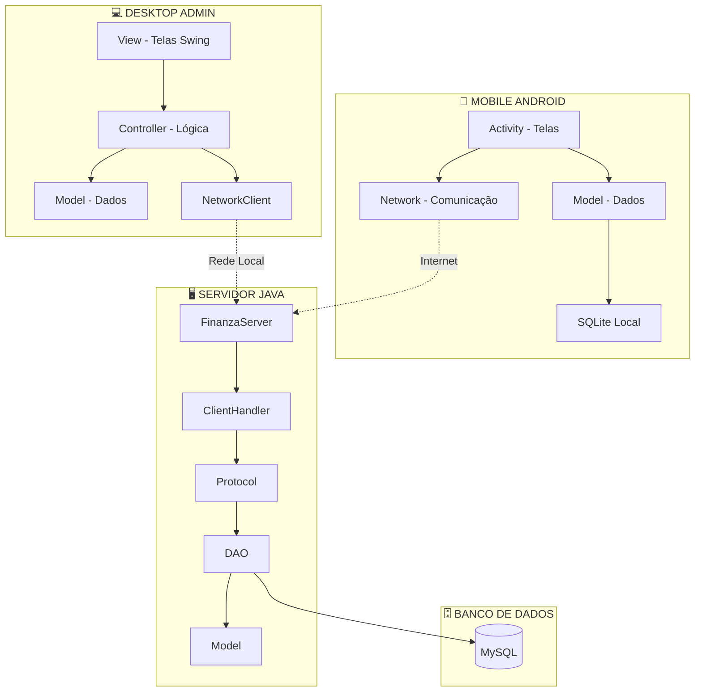

### Componentes Principais

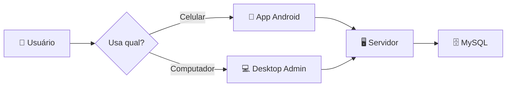

---

## 🔐 Fluxos de Autenticação

### 1. Login - Desktop Admin

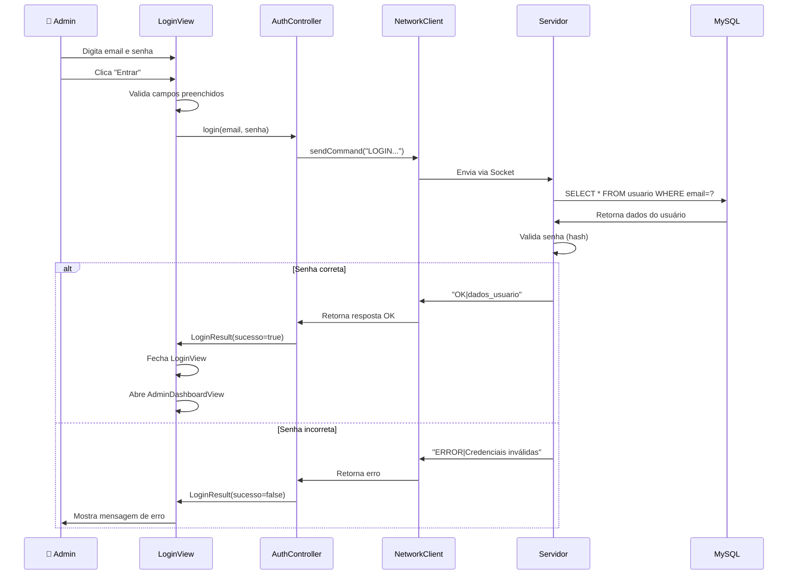

### 2. Login - Mobile Android

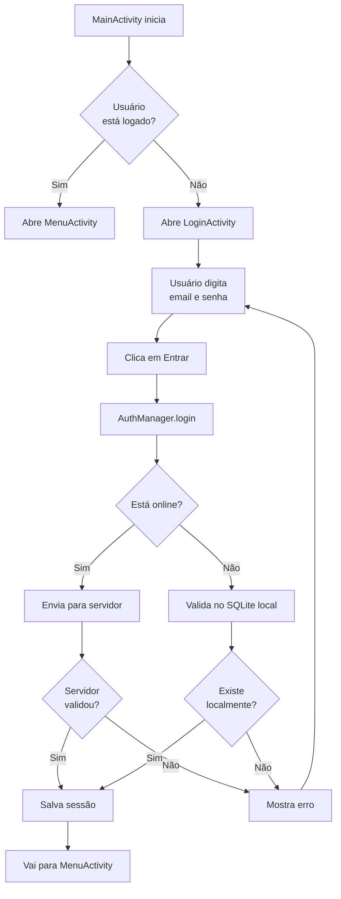

### 3. Registro de Novo Usuário - Mobile

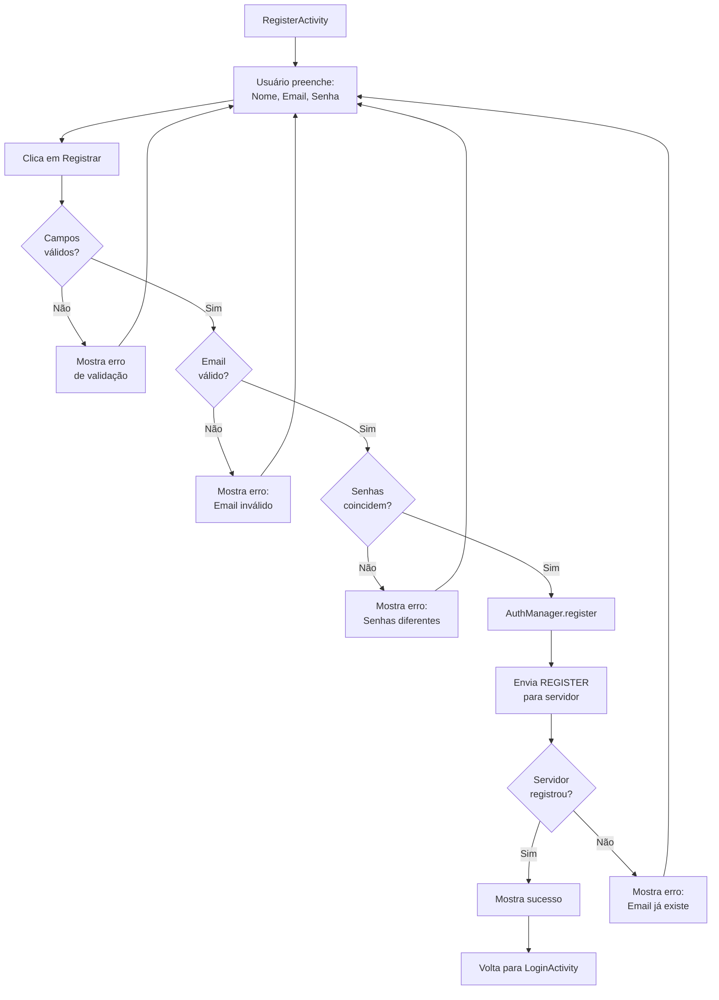

---

## 💻 Fluxos do Desktop Admin

### 1. Listar Todos os Usuários

```mermaid
sequenceDiagram
    participant A as AdminDashboardView
    participant C as AuthController
    participant N as NetworkClient
    participant S as Servidor
    participant P as Protocol
    participant D as UsuarioDAO
    participant DB as MySQL
    
    A->>C: listarUsuarios()
    C->>N: sendCommand("LIST_USERS")
    N->>S: Envia comando
    S->>P: processCommand("LIST_USERS")
    P->>D: listarTodos()
    D->>DB: SELECT * FROM usuario
    DB->>D: Retorna todos os usuários
    D->>P: List<Usuario>
    P->>S: Formata resposta
    S->>N: "OK|user1;user2;user3..."
    N->>C: Retorna lista
    C->>A: List<Usuario>
    A->>A: Exibe na tabela
```

### 2. Editar Usuário

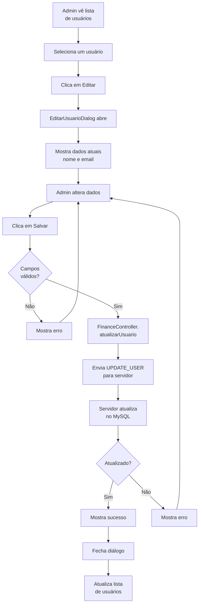

### 3. Alterar Senha de Usuário

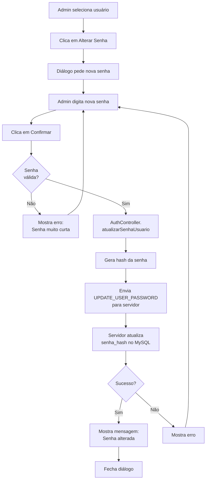

### 4. Excluir Usuário

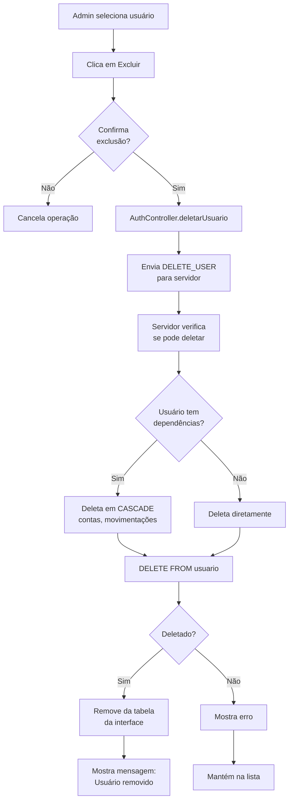

---

## 📱 Fluxos do Mobile

### 1. Visualizar Dashboard / Menu Principal

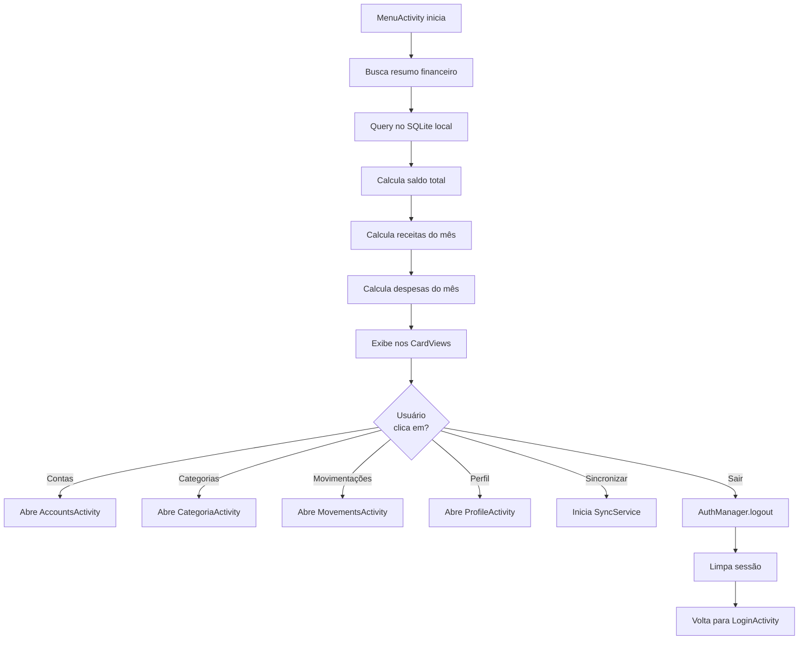

### 2. Adicionar Conta Bancária

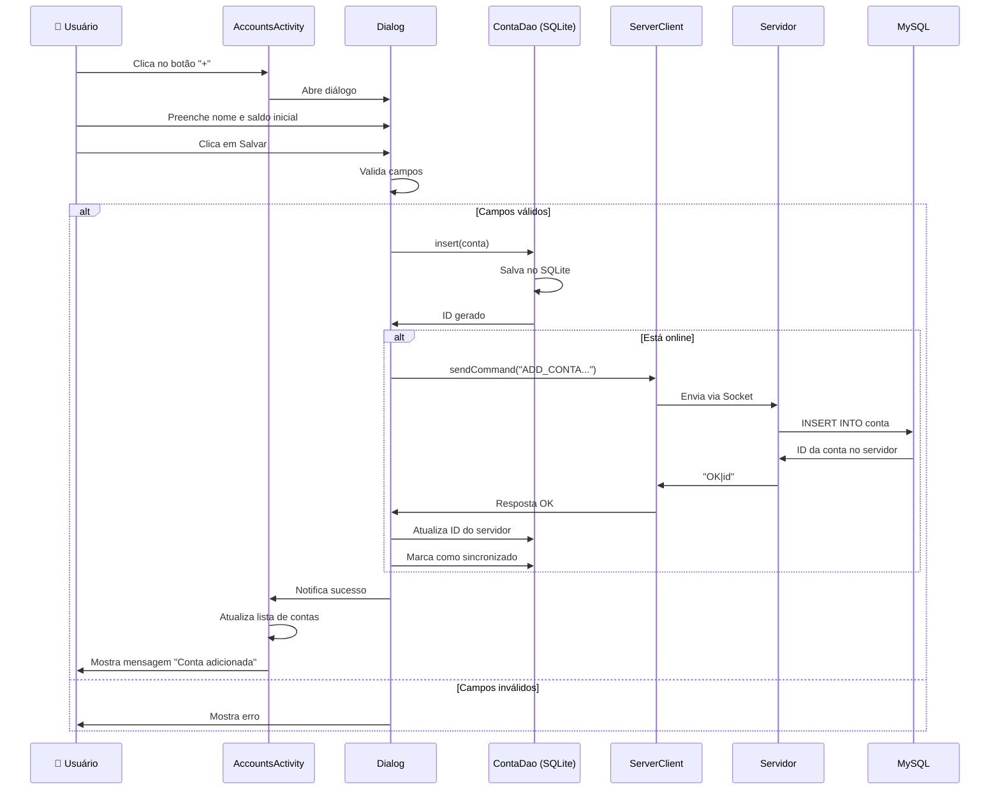

### 3. Adicionar Movimentação (Receita ou Despesa)

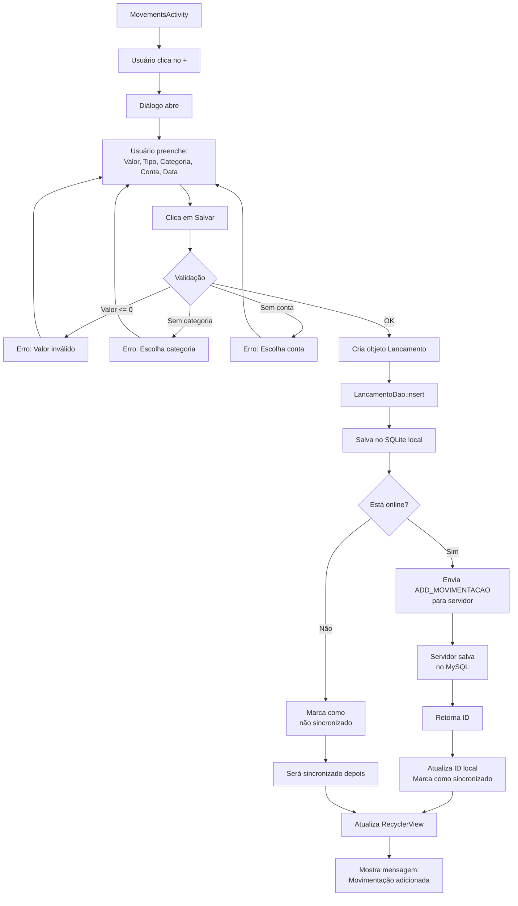

### 4. Filtrar Movimentações

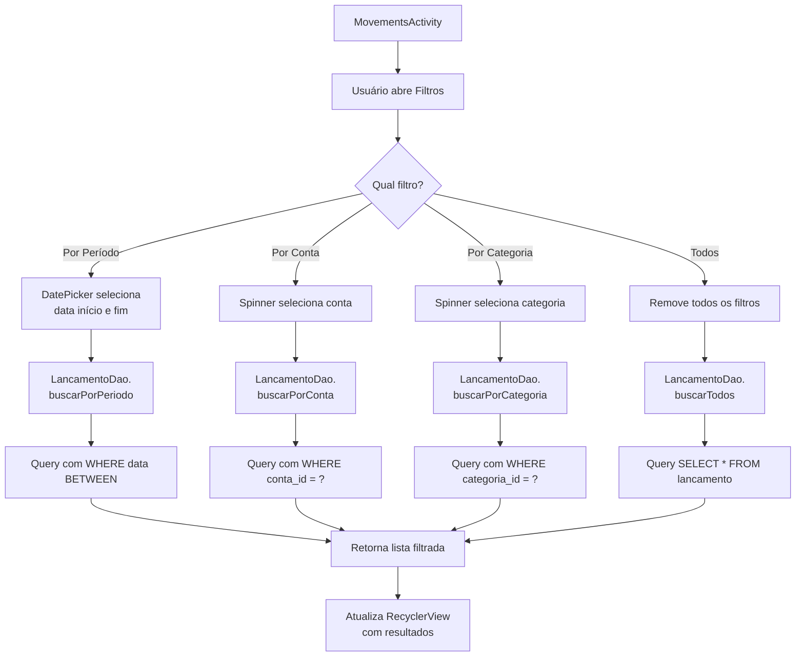

### 5. Editar Perfil

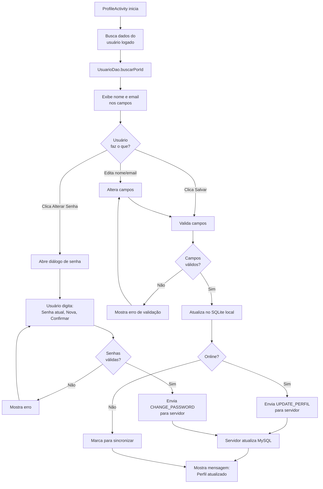

---

## 🖥️ Fluxos do Servidor

### 1. Inicialização do Servidor

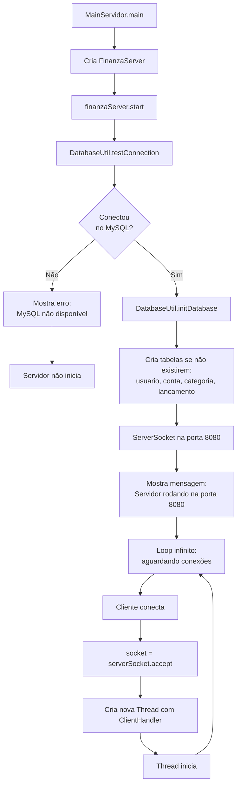

### 2. Processamento de Comando

```mermaid
sequenceDiagram
    participant C as Cliente
    participant H as ClientHandler
    participant P as Protocol
    participant D as DAO
    participant DB as MySQL
    
    C->>H: Envia comando via Socket
    H->>H: Lê linha de texto
    H->>P: processCommand(comando)
    P->>P: Split por "|"
    P->>P: Identifica tipo de comando
    
    alt LOGIN
        P->>D: UsuarioDAO.buscarPorEmail()
        D->>DB: SELECT * FROM usuario
        DB->>D: Retorna usuário
        D->>P: Usuario ou null
        P->>P: Valida senha com SecurityUtil
        P->>H: Formata resposta "OK|dados"
    else ADD_MOVIMENTACAO
        P->>P: Extrai parâmetros
        P->>D: MovimentacaoDAO.inserir()
        D->>DB: INSERT INTO lancamento
        DB->>D: ID gerado
        D->>P: true/false
        P->>H: "OK|id" ou "ERROR|msg"
    else LIST_USERS
        P->>D: UsuarioDAO.listarTodos()
        D->>DB: SELECT * FROM usuario
        DB->>D: List<Usuario>
        D->>P: Lista
        P->>P: Formata lista com ";"
        P->>H: "OK|user1;user2;..."
    end
    
    H->>C: Envia resposta
```

### 3. Gerenciamento de Conexões Múltiplas

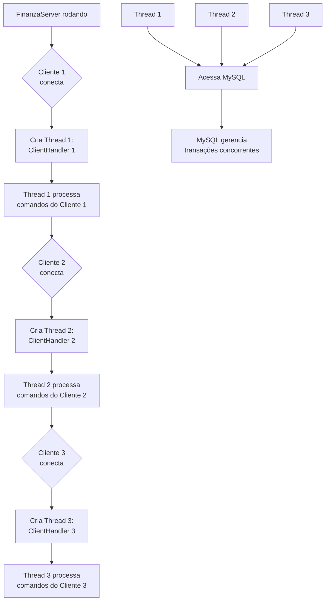

### 4. Validação de Comandos

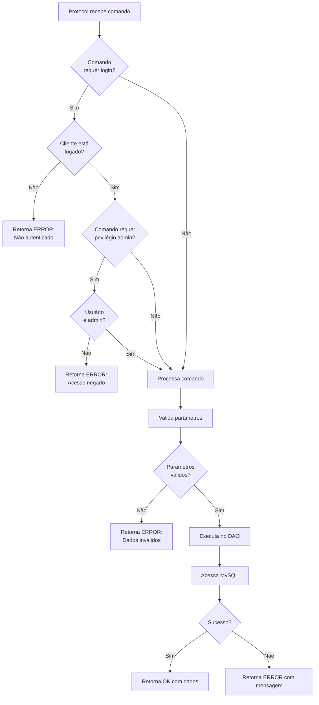

---

## 🔄 Sincronização

### 1. Fluxo de Sincronização Automática

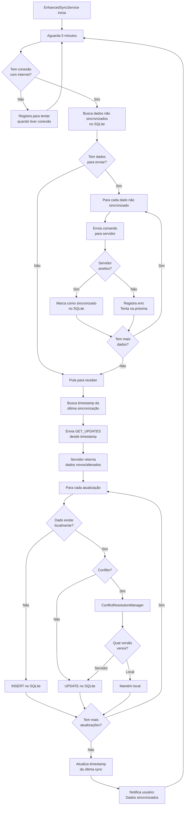

### 2. Sincronização Manual

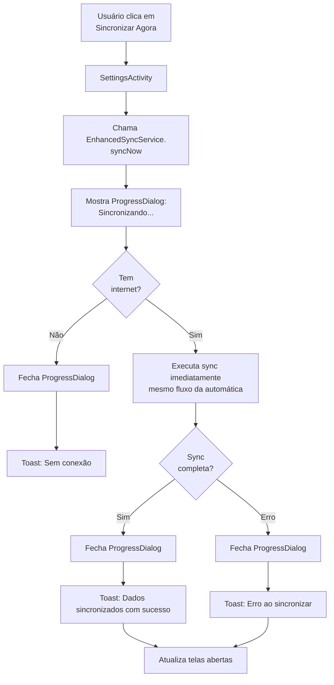

### 3. Resolução de Conflitos

```mermaid
flowchart TD
    A[ConflictResolutionManager<br/>detecta conflito] --> B{Tipo de<br/>conflito?}
    B -->|Mesmo dado alterado<br/>local e servidor| C[Compara timestamps]
    B -->|Dado deletado local<br/>mas alterado servidor| D[Estratégia: DELETE_WINS]
    B -->|Dado deletado servidor<br/>mas alterado local| E[Estratégia: SERVER_WINS]
    
    C --> F{Qual é<br/>mais recente?}
    F -->|Local| G[Mantém versão local]
    F -->|Servidor| H[Aceita versão servidor]
    F -->|Igual| I[Usa estratégia padrão:<br/>SERVER_WINS]
    
    D --> J[Confirma delete local]
    J --> K[Envia DELETE para servidor]
    
    E --> L[Aceita delete do servidor]
    L --> M[Remove do SQLite local]
    
    G --> N[Envia UPDATE para servidor<br/>forçar versão local]
    H --> O[Atualiza SQLite local<br/>com versão servidor]
    I --> O
    
    N --> P[Marca como sincronizado]
    O --> P
    K --> P
    M --> P
    P --> Q[Log do conflito resolvido]
```

### 4. Modo Offline

```mermaid
flowchart TD
    A[App detecta<br/>sem internet] --> B[Ativa modo offline]
    B --> C[Toast: Modo offline ativado]
    C --> D[Usuário usa app normalmente]
    D --> E{Usuário<br/>faz ação?}
    E -->|Adicionar dado| F[Salva no SQLite]
    E -->|Editar dado| G[Atualiza no SQLite]
    E -->|Deletar dado| H[Marca como deletado no SQLite]
    F --> I[Marca como não sincronizado]
    G --> I
    H --> I
    I --> J[Badge/indicador:<br/>X itens não sincronizados]
    J --> D
    
    K[Internet volta] --> L[App detecta conexão]
    L --> M[Toast: Online - Sincronizando...]
    M --> N[EnhancedSyncService<br/>inicia sync automática]
    N --> O[Envia todos os dados<br/>não sincronizados]
    O --> P[Recebe atualizações<br/>do servidor]
    P --> Q[Atualiza SQLite]
    Q --> R[Remove badge]
    R --> S[Toast: Sincronização completa]
```

---

## 📊 Diagramas de Dados

### 1. Fluxo de Dados - Adicionar Movimentação

```mermaid
graph LR
    A[📱 UI:<br/>MovementsActivity] --> B[📝 Dados:<br/>valor, categoria, conta]
    B --> C[💾 SQLite:<br/>INSERT lancamento]
    C --> D{🌐 Online?}
    D -->|Sim| E[📡 Network:<br/>ADD_MOVIMENTACAO]
    D -->|Não| F[🔖 Flag:<br/>não_sincronizado]
    E --> G[🖥️ Servidor:<br/>ClientHandler]
    G --> H[⚙️ Protocol:<br/>processa comando]
    H --> I[🗄️ DAO:<br/>MovimentacaoDAO]
    I --> J[💿 MySQL:<br/>INSERT lancamento]
    J --> K[✅ ID gerado]
    K --> L[📡 Resposta:<br/>OK com ID]
    L --> M[💾 SQLite:<br/>atualiza ID]
    M --> N[🔖 Flag:<br/>sincronizado]
    F --> O[⏳ Aguarda<br/>próxima sync]
    N --> P[📱 UI:<br/>atualiza lista]
    O --> P
```

### 2. Modelo de Dados (Entidades)

```mermaid
erDiagram
    USUARIO ||--o{ CONTA : possui
    USUARIO ||--o{ LANCAMENTO : registra
    CONTA ||--o{ LANCAMENTO : tem
    CATEGORIA ||--o{ LANCAMENTO : classifica
    
    USUARIO {
        int id PK
        string nome
        string email UK
        string senha_hash
        string tipo_usuario
        datetime data_criacao
    }
    
    CONTA {
        int id PK
        string nome
        decimal saldo
        int usuario_id FK
        datetime criada_em
    }
    
    CATEGORIA {
        int id PK
        string nome
        string cor_hex
        string tipo
    }
    
    LANCAMENTO {
        int id PK
        decimal valor
        date data
        string descricao
        string tipo
        int conta_id FK
        int categoria_id FK
        int usuario_id FK
        datetime criado_em
        boolean sincronizado
    }
```

---

## 🎬 Casos de Uso Completos

### 1. Usuário Registra e Usa o App pela Primeira Vez

```mermaid
flowchart TD
    A[📱 Baixa o app] --> B[🚀 Abre pela primeira vez]
    B --> C[👁️ Ve LoginActivity]
    C --> D[👆 Clica em Criar conta]
    D --> E[📝 RegisterActivity abre]
    E --> F[✍️ Preenche:<br/>João, joao@email.com, senha123]
    F --> G[✔️ Clica em Registrar]
    G --> H[📡 Envia para servidor]
    H --> I[🖥️ Servidor valida]
    I --> J{✅ Email<br/>disponível?}
    J -->|Não| K[❌ Erro: Email já existe]
    K --> F
    J -->|Sim| L[💾 Cria no MySQL]
    L --> M[🔐 Hash da senha SHA-256]
    M --> N[✅ Usuário criado]
    N --> O[📲 App recebe OK]
    O --> P[👁️ Volta para LoginActivity]
    P --> Q[✍️ Faz login]
    Q --> R[🏠 MenuActivity abre]
    R --> S[👁️ Ve dashboard vazio]
    S --> T[👆 Clica em Contas]
    T --> U[➕ Adiciona Conta Corrente]
    U --> V[👆 Clica em Categorias]
    V --> W[➕ Adiciona Alimentação, Transporte]
    W --> X[👆 Clica em Movimentações]
    X --> Y[➕ Adiciona primeira despesa]
    Y --> Z[🎉 Começa a usar o sistema!]
```

### 2. Admin Gerencia Usuários no Desktop

```mermaid
flowchart TD
    A[💻 Admin abre Desktop] --> B[👁️ LoginView aparece]
    B --> C[✍️ Digita credenciais admin]
    C --> D[🔐 Faz login]
    D --> E[✅ Validado como admin]
    E --> F[🏠 AdminDashboardView abre]
    F --> G[👁️ Ve tabela com todos os usuários]
    G --> H{🤔 O que fazer?}
    H -->|Ver detalhes| I[👆 Clica em usuário]
    H -->|Editar| J[✏️ Abre EditarUsuarioDialog]
    H -->|Mudar senha| K[🔑 Abre dialog de senha]
    H -->|Excluir| L[🗑️ Confirma exclusão]
    I --> M[ℹ️ Mostra dados completos]
    J --> N[✏️ Altera nome/email]
    N --> O[💾 Salva no servidor]
    K --> P[🔑 Digita nova senha]
    P --> Q[💾 Atualiza no banco]
    L --> R[❌ Remove do sistema]
    R --> S[🧹 Deleta CASCADE<br/>contas e movimentações]
    O --> T[🔄 Atualiza tabela]
    Q --> T
    S --> T
    M --> H
    T --> H
```

---

## 🔍 Explicações Adicionais

### Símbolos Usados

- 📱 Mobile App
- 💻 Desktop
- 🖥️ Servidor
- 🗄️ Banco de Dados
- 👤 Usuário
- 📡 Rede/Internet
- 💾 Salvar
- ✅ Sucesso
- ❌ Erro
- 🔐 Segurança/Login
- ⚙️ Processamento
- 🔄 Atualização

### Como Ler os Diagramas

1. **Flowchart** (→): Fluxo de execução do código
2. **Sequence** (↓): Ordem de chamadas entre componentes
3. **ER Diagram**: Relacionamento entre tabelas
4. **Graph**: Arquitetura geral

### Cores nos Diagramas

- **Verde**: Sucesso, OK
- **Vermelho**: Erro, falha
- **Azul**: Processamento normal
- **Amarelo**: Decisão, verificação

---

## 🎓 Resumo Final

### Padrões Identificados

1. **Cliente → Servidor → Banco**: Sempre esse fluxo
2. **Validação em 3 níveis**: UI → Controller → Servidor
3. **Offline-first no Mobile**: SQLite primeiro, servidor depois
4. **Comandos por String**: Protocolo simples com separador "|"
5. **Thread por Cliente**: Servidor suporta múltiplos clientes

### Principais Fluxos

1. **Autenticação**: Login → Validação → Sessão
2. **CRUD**: Criar → Salvar Local → Enviar Servidor → Sincronizar
3. **Sincronização**: Offline → Fila → Online → Enviar → Receber → Atualizar

---

**🎯 Use este documento para entender visualmente como o sistema funciona!**

**💡 Dica**: No GitHub, esses diagramas Mermaid são renderizados automaticamente. Visualize lá para melhor experiência!
