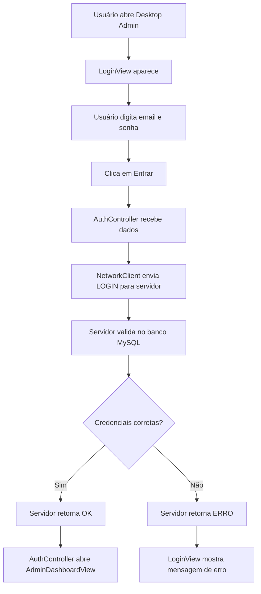
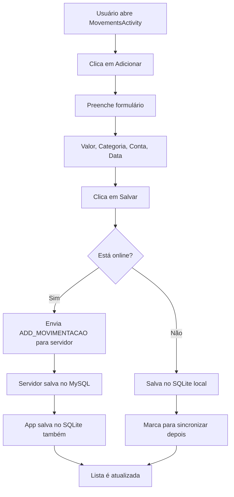
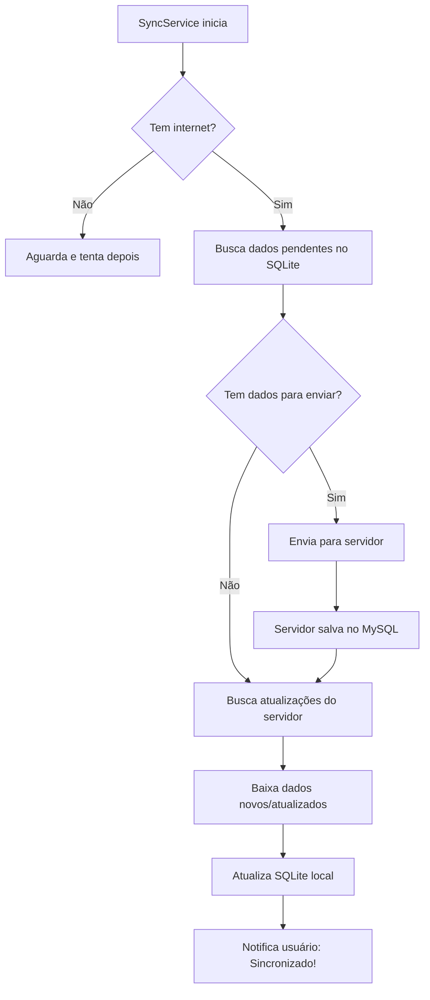
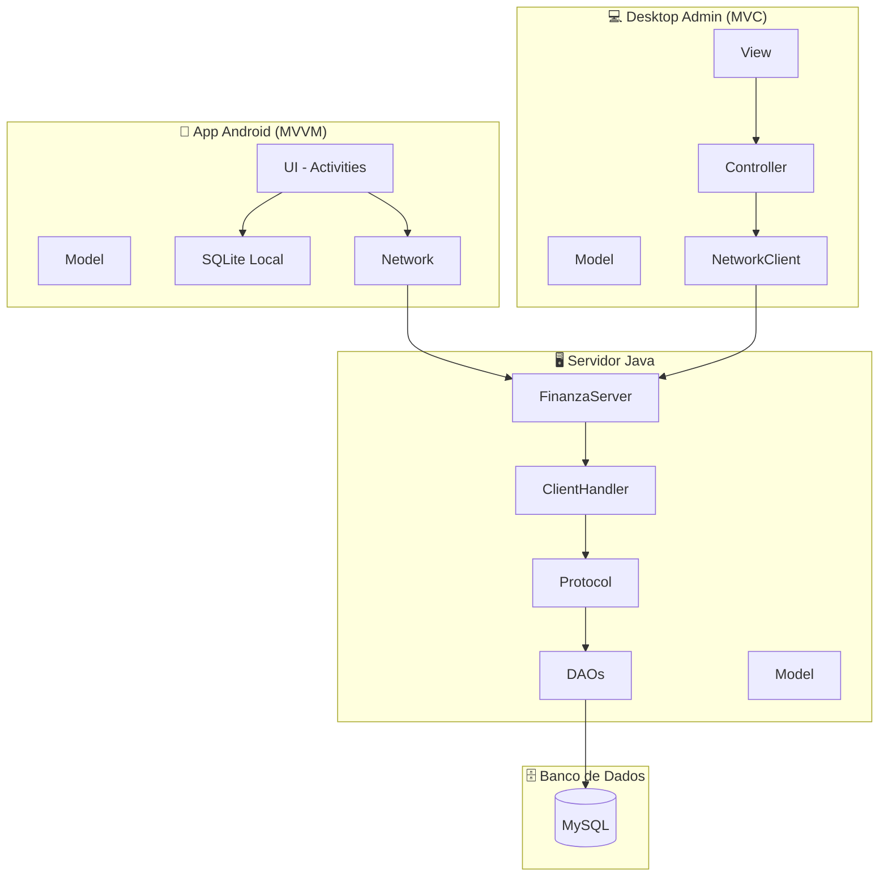

# 🏗️ Arquitetura do Sistema Finanza - Guia Simplificado

## 📖 O que você vai aprender aqui

Este documento explica de forma **simples e clara** como o sistema Finanza está organizado, mesmo se você não tiver conhecimento técnico avançado. Você vai entender:

- O que é **Model** (Modelo) - onde ficam os dados
- O que é **View** (Visão) - o que o usuário vê
- O que é **Controller** (Controlador) - a lógica que conecta tudo
- O que é **DAO** (Acesso a Dados) - como os dados são salvos
- Como tudo funciona junto

---

## 🎯 Visão Geral do Sistema

O sistema Finanza é dividido em **3 partes principais**:

```
┌─────────────────────┐
│  📱 App Android     │  ← Usuário usa no celular
│  (Mobile)           │
└──────────┬──────────┘
           │
           │ Internet (Socket)
           │
┌──────────▼──────────┐
│  🖥️ Servidor Java   │  ← Processa tudo e salva no banco
│  (Backend)          │
└──────────┬──────────┘
           │
┌──────────▼──────────┐
│  🗄️ Banco MySQL     │  ← Guarda todos os dados
└─────────────────────┘

┌─────────────────────┐
│  💻 Desktop Admin   │  ← Administrador gerencia usuários
└──────────┬──────────┘
           │
           └─────────────► Também se conecta ao Servidor
```

---

## 🧩 O que é MVC? (Explicação Simples)

**MVC** significa **Model-View-Controller** (Modelo-Visão-Controlador). É uma forma de organizar o código separando responsabilidades:

### 📦 Model (Modelo)
**O que é**: São as classes que representam os dados do sistema.
**Exemplo prático**: Pense em um formulário de usuário - o Model é como uma "ficha" com os campos: nome, email, senha.

**No Finanza, temos**:
- `Usuario.java` - Representa um usuário (nome, email, tipo)
- `Conta.java` - Representa uma conta bancária (nome, saldo)
- `Categoria.java` - Representa uma categoria de gasto (alimentação, transporte)
- `Movimentacao.java` - Representa uma transação (receita ou despesa)

### 👁️ View (Visão)
**O que é**: É tudo que o usuário **vê e interage** na tela.
**Exemplo prático**: Botões, caixas de texto, listas, menus.

**No Finanza Desktop, temos**:
- `LoginView.java` - Tela de login do administrador
- `AdminDashboardView.java` - Tela principal do admin com lista de usuários
- `EditarUsuarioDialog.java` - Janela para editar dados de um usuário

**No Finanza Mobile, temos**:
- `LoginActivity.java` - Tela de login no celular
- `MenuActivity.java` - Menu principal do app
- `AccountsActivity.java` - Tela de contas
- `MovementsActivity.java` - Tela de transações

### 🎮 Controller (Controlador)
**O que é**: É o "cérebro" que conecta a View com o Model. Ele recebe ações do usuário e decide o que fazer.
**Exemplo prático**: Quando você clica em "Login", o Controller pega o email e senha digitados, valida, e envia para o servidor.

**No Finanza, temos**:
- `AuthController.java` - Controla login, registro, logout
- `FinanceController.java` - Controla operações financeiras (usuários, contas)

### 🗄️ DAO (Data Access Object)
**O que é**: Classes especializadas em **salvar e buscar dados** no banco de dados.
**Exemplo prático**: Quando você cadastra um usuário, o DAO executa o comando SQL para inserir no banco.

**No Finanza, temos**:
- `UsuarioDAO.java` - Salva/busca usuários
- `ContaDAO.java` - Salva/busca contas
- `CategoriaDAO.java` - Salva/busca categorias
- `MovimentacaoDAO.java` - Salva/busca transações

---

## 🖥️ Desktop Admin - Estrutura Detalhada

O **Desktop Admin** usa a arquitetura **MVC** (Model-View-Controller).

### 📂 Estrutura de Pastas

```
ClienteFinanza/
├── src/
│   ├── model/           ← Modelos de dados
│   │   ├── Usuario.java
│   │   ├── Conta.java
│   │   ├── Categoria.java
│   │   └── Movimentacao.java
│   │
│   ├── view/            ← Interface gráfica (telas)
│   │   ├── LoginView.java
│   │   ├── AdminDashboardView.java
│   │   └── EditarUsuarioDialog.java
│   │
│   ├── controller/      ← Lógica de controle
│   │   ├── AuthController.java
│   │   └── FinanceController.java
│   │
│   ├── util/            ← Utilitários
│   │   └── NetworkClient.java
│   │
│   └── MainCliente.java ← Ponto de entrada do programa
```

### 📋 O que cada arquivo faz

#### 🏠 MainCliente.java
**O que faz**: Arquivo principal que inicia o programa Desktop Admin.
**Responsabilidade**: Cria a tela de login e inicia a aplicação.

#### 📦 Model (Modelos)

**Usuario.java**
- **O que faz**: Representa um usuário do sistema.
- **Atributos**: id, nome, email, tipoUsuario (admin ou usuario), dataCriacao.
- **Analogia**: É como uma ficha cadastral de uma pessoa.

**Conta.java**
- **O que faz**: Representa uma conta bancária.
- **Atributos**: id, nome, saldo, usuarioId.
- **Analogia**: Como uma conta corrente ou poupança.

**Categoria.java**
- **O que faz**: Representa uma categoria de transação.
- **Atributos**: id, nome, cor, tipo (receita/despesa).
- **Analogia**: Como uma etiqueta para organizar gastos (ex: "Alimentação", "Transporte").

**Movimentacao.java**
- **O que faz**: Representa uma transação financeira.
- **Atributos**: id, valor, data, descricao, contaId, categoriaId, tipo.
- **Analogia**: Um registro de entrada ou saída de dinheiro.

#### 👁️ View (Telas)

**LoginView.java**
- **O que faz**: Mostra a tela de login para administradores.
- **Elementos**: Campos de email/senha, botões de entrar e registrar.
- **Responsabilidade**: Captura os dados do usuário e chama o AuthController.

**AdminDashboardView.java**
- **O que faz**: Tela principal do administrador após o login.
- **Elementos**: Lista de todos os usuários, botões para editar/excluir.
- **Responsabilidade**: Exibe informações e permite gerenciar usuários.

**EditarUsuarioDialog.java**
- **O que faz**: Janela popup para editar dados de um usuário.
- **Elementos**: Campos de nome/email, botão salvar.
- **Responsabilidade**: Permite editar informações de usuários.

#### 🎮 Controller (Controladores)

**AuthController.java**
- **O que faz**: Controla toda a parte de autenticação (login/registro).
- **Responsabilidades**:
  - Conectar ao servidor
  - Fazer login de administrador
  - Registrar novos administradores
  - Fazer logout
  - Buscar lista de usuários
  - Atualizar dados de usuários
  - Alterar senhas
  - Deletar usuários
- **Como funciona**: Envia comandos para o servidor via NetworkClient e processa as respostas.

**FinanceController.java**
- **O que faz**: Controla operações relacionadas a finanças.
- **Responsabilidades**: Gerenciar contas, categorias e movimentações.

#### 🔧 Util (Utilitários)

**NetworkClient.java**
- **O que faz**: Gerencia a conexão de rede com o servidor.
- **Responsabilidades**:
  - Conectar ao servidor na porta 8080
  - Enviar comandos
  - Receber respostas
  - Manter a conexão aberta
- **Como funciona**: Usa Sockets Java para comunicação TCP/IP.

---

## 🖥️ Servidor - Estrutura Detalhada

O **Servidor** é o "coração" do sistema. Ele recebe requisições, processa e salva tudo no banco de dados.

### 📂 Estrutura de Pastas

```
ServidorFinanza/
├── src/
│   ├── model/           ← Modelos de dados
│   │   ├── Usuario.java
│   │   ├── Conta.java
│   │   ├── Categoria.java
│   │   └── Movimentacao.java
│   │
│   ├── dao/             ← Acesso ao banco de dados
│   │   ├── UsuarioDAO.java
│   │   ├── ContaDAO.java
│   │   ├── CategoriaDAO.java
│   │   └── MovimentacaoDAO.java
│   │
│   ├── server/          ← Lógica do servidor
│   │   ├── FinanzaServer.java
│   │   ├── ClientHandler.java
│   │   └── Protocol.java
│   │
│   ├── util/            ← Utilitários
│   │   ├── DatabaseUtil.java
│   │   └── SecurityUtil.java
│   │
│   └── MainServidor.java ← Inicia o servidor
```

### 📋 O que cada arquivo faz

#### 🏠 MainServidor.java
**O que faz**: Arquivo principal que inicia o servidor.
**Responsabilidade**: Cria uma instância de FinanzaServer e começa a escutar por conexões.

#### 📦 Model (Modelos)

Os modelos do servidor são idênticos aos do cliente (Usuario, Conta, Categoria, Movimentacao).

#### 🗄️ DAO (Acesso a Dados)

**UsuarioDAO.java**
- **O que faz**: Gerencia usuários no banco de dados MySQL.
- **Operações**:
  - `inserir()` - Cadastra novo usuário
  - `buscarPorEmail()` - Encontra usuário pelo email
  - `buscarPorId()` - Encontra usuário pelo ID
  - `atualizar()` - Atualiza dados do usuário
  - `atualizarSenha()` - Muda a senha
  - `deletar()` - Remove usuário
  - `listarTodos()` - Retorna todos os usuários

**ContaDAO.java**
- **O que faz**: Gerencia contas bancárias no banco.
- **Operações**: inserir, buscar, atualizar, deletar, listar por usuário.

**CategoriaDAO.java**
- **O que faz**: Gerencia categorias de transações no banco.
- **Operações**: inserir, buscar, atualizar, deletar, listar por tipo (receita/despesa).

**MovimentacaoDAO.java**
- **O que faz**: Gerencia transações financeiras no banco.
- **Operações**: inserir, buscar, atualizar, deletar, listar por período/conta.

#### 🌐 Server (Servidor)

**FinanzaServer.java**
- **O que faz**: Servidor principal que escuta conexões de clientes.
- **Responsabilidades**:
  - Iniciar servidor na porta 8080
  - Aceitar múltiplas conexões simultâneas
  - Para cada cliente, criar uma thread ClientHandler
- **Como funciona**: Fica em loop infinito esperando clientes se conectarem.

**ClientHandler.java**
- **O que faz**: Gerencia a comunicação com UM cliente específico.
- **Responsabilidades**:
  - Receber comandos do cliente
  - Processar comandos usando Protocol
  - Chamar os DAOs apropriados
  - Enviar respostas de volta
- **Como funciona**: Cada cliente conectado tem seu próprio ClientHandler rodando em uma thread separada.

**Protocol.java**
- **O que faz**: Define o protocolo de comunicação entre cliente e servidor.
- **Responsabilidades**:
  - Definir formato dos comandos (ex: LOGIN|email|senha)
  - Processar comandos recebidos
  - Chamar os DAOs corretos
  - Formatar respostas
- **Comandos suportados**: LOGIN, REGISTER, LIST_USERS, UPDATE_USER, ADD_CONTA, LIST_MOVIMENTACOES, etc.

#### 🔧 Util (Utilitários)

**DatabaseUtil.java**
- **O que faz**: Gerencia conexão com o banco de dados MySQL.
- **Responsabilidades**:
  - Criar conexão com MySQL
  - Fornecer conexões para os DAOs
  - Inicializar tabelas do banco

**SecurityUtil.java**
- **O que faz**: Funções de segurança.
- **Responsabilidades**:
  - Gerar hash de senhas (SHA-256)
  - Validar senhas

---

## 📱 Mobile Android - Estrutura Detalhada

O **App Android** usa a arquitetura **MVVM** (Model-View-ViewModel) e também tem um banco de dados local (SQLite) para funcionar offline.

### 📂 Estrutura de Pastas

```
app/src/main/java/com/example/finanza/
├── model/              ← Modelos de dados
│   ├── Usuario.java
│   ├── Conta.java
│   ├── Categoria.java
│   └── Lancamento.java
│
├── db/                 ← Banco de dados local (SQLite)
│   ├── AppDatabase.java
│   ├── UsuarioDao.java
│   ├── ContaDao.java
│   ├── CategoriaDao.java
│   └── LancamentoDao.java
│
├── ui/                 ← Telas (Activities)
│   ├── LoginActivity.java
│   ├── RegisterActivity.java
│   ├── MenuActivity.java
│   ├── AccountsActivity.java
│   ├── CategoriaActivity.java
│   ├── MovementsActivity.java
│   ├── ProfileActivity.java
│   └── SettingsActivity.java
│
├── network/            ← Comunicação com servidor
│   ├── ServerClient.java
│   ├── Protocol.java
│   ├── AuthManager.java
│   ├── SyncService.java
│   ├── EnhancedSyncService.java
│   └── ConflictResolutionManager.java
│
├── util/               ← Utilitários
│   └── DataIntegrityValidator.java
│
└── MainActivity.java   ← Ponto de entrada
```

### 📋 O que cada arquivo faz

#### 📦 Model (Modelos)

Similar aos modelos do Desktop, mas adaptados para Android:
- **Usuario.java** - Usuário do app
- **Conta.java** - Conta bancária
- **Categoria.java** - Categoria de transação
- **Lancamento.java** - Transação financeira (receita/despesa)

#### 🗄️ DB (Banco de Dados Local - SQLite)

**AppDatabase.java**
- **O que faz**: Configura o banco de dados SQLite local do app.
- **Por que existe**: Permite o app funcionar offline.

**UsuarioDao.java, ContaDao.java, CategoriaDao.java, LancamentoDao.java**
- **O que fazem**: Gerenciam dados no banco SQLite local.
- **Operações**: inserir, buscar, atualizar, deletar localmente.

#### 📱 UI (Telas - Activities)

**MainActivity.java**
- **O que faz**: Tela inicial do app que decide para onde ir.
- **Fluxo**: Se usuário está logado → MenuActivity, senão → LoginActivity.

**LoginActivity.java**
- **O que faz**: Tela de login do usuário.
- **Elementos**: Campos de email/senha, botões entrar e registrar.

**RegisterActivity.java**
- **O que faz**: Tela de cadastro de novo usuário.
- **Elementos**: Campos de nome/email/senha.

**MenuActivity.java**
- **O que faz**: Menu principal após login.
- **Elementos**: Dashboard com saldo total, botões para contas, categorias, movimentações.

**AccountsActivity.java**
- **O que faz**: Gerenciar contas bancárias.
- **Funcionalidades**: Listar, adicionar, editar, excluir contas.

**CategoriaActivity.java**
- **O que faz**: Gerenciar categorias de gastos.
- **Funcionalidades**: Listar, adicionar, editar, excluir categorias.

**MovementsActivity.java**
- **O que faz**: Gerenciar transações (receitas e despesas).
- **Funcionalidades**: Listar, adicionar, editar, excluir movimentações.

**ProfileActivity.java**
- **O que faz**: Exibir e editar perfil do usuário.
- **Funcionalidades**: Alterar nome, email, senha.

**SettingsActivity.java**
- **O que faz**: Configurações do app.
- **Funcionalidades**: Sincronização, logout.

#### 🌐 Network (Comunicação)

**ServerClient.java**
- **O que faz**: Cliente que se conecta ao servidor Java.
- **Responsabilidades**: Enviar comandos e receber respostas via Socket.

**Protocol.java**
- **O que faz**: Define os comandos que o app pode enviar ao servidor.
- **Comandos**: LOGIN, REGISTER, ADD_CONTA, LIST_MOVIMENTACOES, etc.

**AuthManager.java**
- **O que faz**: Gerencia autenticação do usuário.
- **Responsabilidades**: Login, registro, logout, manter sessão.

**SyncService.java**
- **O que faz**: Serviço que sincroniza dados com o servidor.
- **Como funciona**: Roda em background, envia dados locais para servidor e baixa atualizações.

**EnhancedSyncService.java**
- **O que faz**: Versão melhorada do serviço de sincronização.
- **Melhorias**: Sincronização mais inteligente e eficiente.

**ConflictResolutionManager.java**
- **O que faz**: Resolve conflitos quando os mesmos dados foram alterados no app e servidor.
- **Estratégia**: Geralmente o servidor tem prioridade.

#### 🔧 Util (Utilitários)

**DataIntegrityValidator.java**
- **O que faz**: Valida integridade dos dados.
- **Responsabilidades**: Garantir que dados estão corretos antes de salvar.

---

## 🔄 Fluxogramas Simples

### 1️⃣ Fluxo de Login (Desktop Admin)



### 2️⃣ Fluxo de Listar Usuários (Desktop Admin)

```mermaid
graph TD
    A[AdminDashboardView carrega] --> B[AuthController.listarUsuarios()]
    B --> C[NetworkClient envia LIST_USERS]
    C --> D[Servidor recebe comando]
    D --> E[ClientHandler processa]
    E --> F[UsuarioDAO.listarTodos()]
    F --> G[Busca no banco MySQL]
    G --> H[Retorna lista de usuários]
    H --> I[Servidor envia lista]
    I --> J[AdminDashboardView exibe na tabela]
```

### 3️⃣ Fluxo de Adicionar Transação (Mobile)



### 4️⃣ Fluxo de Sincronização (Mobile)



### 5️⃣ Arquitetura Completa



---

## 📊 Como tudo funciona junto - Exemplo Prático

### Cenário: Usuário adiciona uma despesa no celular

1. **Mobile - UI (MovementsActivity)**
   - Usuário preenche: R$ 50,00, Categoria "Alimentação", Conta "Corrente"
   - Clica em "Salvar"

2. **Mobile - Network (ServerClient)**
   - Cria comando: `ADD_MOVIMENTACAO|50.00|2024-11-04|Almoço|1|2|despesa`
   - Envia via Socket para o servidor

3. **Servidor - Server (ClientHandler)**
   - Recebe o comando
   - Passa para Protocol processar

4. **Servidor - Protocol**
   - Identifica que é ADD_MOVIMENTACAO
   - Extrai os parâmetros
   - Chama MovimentacaoDAO.inserir()

5. **Servidor - DAO (MovimentacaoDAO)**
   - Executa SQL: `INSERT INTO lancamentos VALUES (...)`
   - Banco MySQL salva a transação

6. **Servidor - Response**
   - Retorna: `OK|123` (123 é o ID da nova transação)

7. **Mobile - Network**
   - Recebe resposta OK
   - Salva também no SQLite local

8. **Mobile - UI**
   - Atualiza a lista de movimentações
   - Mostra mensagem: "Despesa adicionada com sucesso!"

---

## 🎓 Resumo Para Não-Técnicos

**Se você não entende de programação, pense assim:**

- **Model** = Ficha de cadastro (dados)
- **View** = Tela do computador/celular (o que você vê)
- **Controller** = Pessoa que recebe sua solicitação e faz acontecer
- **DAO** = Arquivador que guarda e busca documentos (banco de dados)
- **Servidor** = Central telefônica que conecta tudo
- **Socket** = Linha telefônica (conexão de rede)

### Analogia do Sistema Completo

Imagine o sistema como um restaurante:

1. **Cliente (Mobile/Desktop)** = Você, o cliente do restaurante
2. **Garçom (Controller)** = Anota seu pedido e leva para a cozinha
3. **Cardápio (View)** = Menu que você lê
4. **Pedido (Model)** = Papel com o que você quer
5. **Cozinha (Servidor)** = Onde preparam seu pedido
6. **Despensa (Banco de Dados)** = Onde guardam os ingredientes
7. **Chef (Protocol)** = Interpreta o pedido e coordena
8. **Auxiliar (DAO)** = Pega ingredientes da despensa

**Fluxo**: Você lê o cardápio (View) → Faz pedido (Model) → Garçom anota (Controller) → Leva para cozinha (Servidor) → Chef lê pedido (Protocol) → Auxiliar pega ingredientes (DAO) → Prato pronto volta para você!

---

## 🔗 Próximos Passos

Para entender melhor:

1. **Comece pelos Modelos** - São os mais simples de entender
2. **Depois veja as Views** - Veja como as telas são feitas
3. **Explore os Controllers** - Entenda como as ações são processadas
4. **Por fim, estude os DAOs** - Veja como dados são salvos

**Documentação Técnica Completa**: [docs/README.md](README.md)
**Diagramas Visuais**: [docs/images/](images/)
**PDF Completo**: [docs/Finanza_Sistema_Completo.pdf](Finanza_Sistema_Completo.pdf)

---

**📝 Dica Final**: Este documento foi feito para ser entendido por qualquer pessoa. Se algo ainda não ficou claro, releia a seção "Analogia do Sistema Completo" - ela usa exemplos do dia a dia para explicar conceitos técnicos!
